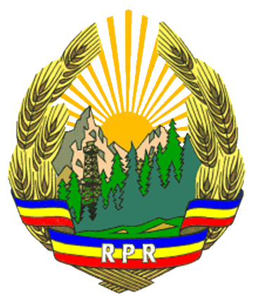

## Capitol introductiv

Republica Populara Romana este un stat al oamenilor muncii de la orase si sate.

Republica Populara Romana a luat nastere ca urmare a victoriei istorice a Uniunii Sovietice asupra fascismului german si a eliberarii Romaniei de catre glorioasa Armata Sovietica, eliberare care a dat putinta poporului muncitor, in frunte cu clasa muncitoare condusa de Partidul Comunist, sa doboare dictatura fascista, sa nimiceasca puterea claselor exploatatoare si sa faureasca statul de democratie populara, care corespunde pe deplin intereselor si nazuintelor maselor populare din Romania.

Astfel s-au putut incununa cu o victorie istorica lupta de secole dusa de poporul muncitor roman pentru libertate si independenta nationala, luptele eroice ale clasei muncitoare aliata cu taranimea muncitoare pentru doborirea regimului capitalisto-mosieresc si scuturarea jugului imperialist.

Faurirea si intarirea statului de democratie populara, prietenia si alianta cu marea Uniune Sovietica, sprijinul si ajutorul ei dezinteresat si fratesc asigura independenta, suveranitatea de stat, dezvoltarea si inflorirea Republicii Populare Romane.

Fortele armate ale Republicii Populare Romane stau de straja hotarelor tarii, suveranitatii si independentei poporului roman, securitatii sale si pacii.

Politica externa a Republicii Populare Romane este o politica de aparare a pacii, de prietenie si alianta cu Uniunea Republicilor Sovietice Socialiste si cu tarile de democratie populara, o politica de pace si prietenie cu toate popoarele iubitoare de pace.

Minoritatile nationale din Republica Populara Romana se bucura de deplina egalitate in drepturi cu poporul roman. In Republica Populara Romana se asigura autonomie administrativ-teritoriala populatiei maghiare din raioanele secuesti, unde ea formeaza o masa compacta.

Prezenta Constitutie a Republicii Populare Romane consacra rezultatele obtinute pana acum de oamenii muncii, in frunte cu clasa muncitoare, in opera de construire a societatii socialiste in tara noastra.

Politica statului de democratie populara este indreptata spre lichidarea exploatarii omului de catre om si construirea socialismului.

## Capitolul 1. Oranduirea sociala

### Articolul 1.

Republica Populara Romana este un stat al oamenilor muncii de la orase si sate.

### Articolul 2.

Baza puterii populare in Republica Populara Romana este alianta clasei muncitoare cu taranimea muncitoare, in care rolul conducator apartine clasei muncitoare.

### Articolul 3.

Republica Populara Romana s-a nascut si s-a intarit ca rezultat al eliberarii tarii de catre fortele armate ale Uniunii Republicilor Sovietice Socialiste de sub jugul fascismului si de sub dominatia imperialista, ca rezultat al doboririi puterii mosierilor si capitalistilor de catre masele de la orase si sate in frunte cu clasa muncitoare, sub conducerea Partidului Comunist Roman.

### Articolul 4.

In Republica Populara Romana puterea apartine oamenilor muncii de la orase si sate, care o exercita prin Marea Adunare Nationala si Sfaturile Populare.
Sfaturile Populare constituie baza politica a Republicii Populare Romane.

### Articolul 5.

Economia nationala a Republicii Populare Romane cuprinde trei formatiuni social-economice: formatiunea socialista, mica productie de marfuri si formatiunea particular-capitalista.

### Articolul 6.

Fundamentul formatiunii social-economice socialiste este proprietatea socialista asupra mijloacelor de productie care are fie forma proprietatii de stat (bun comun al poporului), fie forma proprietatii cooperatiste-colectiviste (proprietatea gospodariilor agricole colective sau a organizatiilor cooperatiste).
In formatiunea socialista a economiei nationale este lichidata exploatarea omului de catre om.
Formatiunea socialista, careia ii apartine rolul conducator in economia nationala a Republicii Populare Romane, constituie baza dezvoltarii tarii pe calea socialismului. Statul de democratie populara, proclamand ca principala sarcina a sa construirea socialismului, intareste si largeste neincetat formatiunea socialista, asigura cresterea neintrerupta a bunei stari materiale si a nivelului cultural al oamenilor muncii.

### Articolul 7.

Bogatiile de orice natura ale subsolului, fabricile, uzinele si minele, padurile, apele, izvoarele de energie naturala, caile de comunicatie de orice fel, transportul feroviar, fluvial, maritim si aerian, bancile, posta, telegraful, telefonul, radio-ul, mijloacele de tipar, cinematografia si teatrul, gospodariile agricole de stat, statiunile de masini si tractoare, intreprinderile comunale si partea nationalizata a fondului de locuinte de la orase, constituie proprietate de stat, bun comun al poporului.

### Articolul 8.

Pamantul in Republica Populara Romana apartine celor ce-l muncesc.

### Articolul 9.

Inventarul viu si mort al gospodariilor agricole colective si al cooperativelor, productia realizata, cat si toate intreprinderile sau constructiile ce le apartin, reprezinta proprietatea obsteasca a gospodariilor agricole colective si a cooperativelor.
Taranii membri ai gospodariilor agricole colective au in folosinta personala un lot de pamant pe langa casa si in proprietate personala gospodaria de pe acest lot, casa de locuit, animalele productive, pasari, inventar agricol marunt – in conformitate cu statutul gospodariei agricole colective.

### Articolul 10.

Mica productie de marfuri in Republica Populara Romana cuprinde gospodariile taranesti mici si mijlocii, care poseda proprietate particulara asupra pamantului bazata pe munca proprie a producatorului, ca si atelierele meseriasilor care nu exploateaza munca altora. Statul ocroteste dreptul de proprietate particulara asupra pamantului a taranilor cu gospodarii mici si mijlocii, pe baza legilor in vigoare.
Statul democrat-popular sprijina pe taranii cu gospodarii mici si mijlocii si pe meseriasi, cu scopul de a-i feri de exploatarea capitalista, de a spori productia realizata de ei si de a ridica bunastarea lor.

### Articolul 11.

Formatiunea particular-capitalista in Republica Populara Romana cuprinde gospodariile chiaburesti, intreprinderile comerciale particulare, micile intreprinderi industriale nenationalizate, bazate pe exploatarea muncii salariate.
Statul democrat-popular realizeaza in mod consecvent politica de ingradire si eliminare a elementelor capitaliste.

### Articolul 12.

Dreptul de proprietate personala a cetatenilor Republicii Populare Romane asupra veniturilor si economiilor provenite din munca, asupra casei de locuit si gospodariei auxiliare pe langa casa, asupra obiectelor casnice si de uz personal, cat si dreptul de mostenire asupra proprietatii personale a cetatenilor sunt ocrotite de lege.

### Articolul 13.

Viata economica a Republicii Populare Romane se dezvolta pe baza planului de stat al economiei nationale, in interesul construirii socialismului, cresterii neincetate a bunei stari materiale si culturale a oamenilor muncii, intaririi independentei nationale a tarii si a capacitatii ei de aparare.

### Articolul 14.

In Republica Populara Romana, comertul exterior este monopol de stat.

### Articolul 15.

In Republica Populara Romana munca este o datorie si o chestiune de onoare pentru fiecare cetatean capabil de munca, dupa principiul “cine nu munceste, nu mananca”. In Republica Populara Romana se infaptuieste tot mai larg principiul socialismului: “De la fiecare dupa capacitatile sale, fiecaruia dupa munca sa”.

## Capitolul 2. Oranduirea de stat

### Articolul 16.

Regimul de stat al Republicii Populare Romane este regimul democratiei populare, care reprezinta puterea oamenilor muncii.

### Articolul 17.

Statul roman democrat-popular – stat unitar, suveran si independent:
- a) apara independenta si suveranitatea poporului roman, cuceririle oamenilor muncii de la orase si sate, drepturile, libertatile si puterea oamenilor muncii, impotriva dusmanilor poporului muncitor;
- b) asigura intarirea si dezvoltarea fortelor de productie ale tarii prin industrializarea ei socialista, prin lichidarea inapoierii economice, tehnice si culturale, prin transformarea socialista treptata a agriculturii pe baza liberului consimtamant al taranilor muncitori;
- c) organizeaza si dezvolta economia planificata, bazandu-se pe intreprinderile de stat si cooperatiste;
- d) organizeaza apararea Republicii de dusmanii externi si conduce fortele armate ale tarii;
- e) asigura securitatea interna a cetatenilor, face inofensivi si reprima pe dusmanii poporului;
- f) conduce sistemul banesc si de credite, elaboreaza si realizeaza bugetul de stat, stabileste impozitele, taxele si veniturile necesare pentru nevoile statului;
- g) administreaza bancile, intreprinderile si institutiile de stat industriale, agricole si comerciale;
- h) conduce invatamantul public de toate gradele;
- i) asigura cresterea continua a bunei stari si sanatatea maselor populare de la orase si sate;
- j) asigura dezvoltarea culturii poporului roman si a culturii minoritatilor nationale, socialista in continut, nationala in forma;
- k) vegheaza la aplicarea si respectarea Constitutiei si legilor Republicii Populare Romane, ele fiind expresia vointei si intereselor poporului muncitor.
Respectarea si aplicarea intocmai a Constitutiei si a legilor tarii este datoria principala a fiecarei institutii de stat si a fiecarui cetatean, ele fiind obligatorii pe intreg teritoriul Republicii.

### Articolul 18.

Republica Populara Romana are urmatoarea impartire administrativ-teritoriala:
Regiunile: Arad, Bacau, Baia Mare, Barlad, Bucuresti, Cluj, Constanta, Craiova, Galati, Hunedoara, Iasi, Oradea, Pitesti, Ploiesti, Stalin, Suceava, Timisoara, Regiunea Autonoma Maghiara.

### Articolul 19.

Regiunea Autonoma Maghiara a Republicii Populare Romane este formata din teritoriul locuit de populatia compacta maghiara secuiasca si are conducere administrativa autonoma, aleasa de populatia Regiunii Autonome.
Regiunea Autonoma Maghiara cuprinde raioanele: Ciuc, Gheorgheni, Odorhei, Reghin, Sangeorgiu de Padure, Sf. Gheorghe, Targu-Mures, Targu-Sacuesc, Toplita.
Centrul administrativ al Regiunii Autonome Maghiare este orasul Targu-Mures.

### Articolul 20.

Legile Republicii Populare Romane, hotaririle si dispozitiile organelor centrale ale statului sunt obligatorii pe teritoriul Regiunii Autonome Maghiare.

### Articolul 21.

Regulamentul Regiunii Autonome Maghiare este elaborat de Sfatul Popular al Regiunii Autonome si supus spre aprobare Marii Adunari Nationale a Republicii Populare Romane.

## Capitolul 3. Organul suprem al puterii de stat a Republicii Populare Romane

### Articolul 22.

Organul suprem al puterii de stat a Republicii Populare Romane este Marea Adunare Nationala a Republicii Populare Romane.

### Articolul 23.

Marea Adunare Nationala este unicul organ legiuitor al Republicii Populare Romane.

### Articolul 24.

Marea Adunare Nationala are in competenta sa directa:
- a) alegerea Prezidiului Marii Adunari Nationale a Republicii Populare Romane;
- b) formarea Guvernului Republicii Populare Romane;
- c) modificarea Constitutiei;
- d) chestiunile razboiului si ale pacii;
- e) stabilirea planurilor economiei nationale;
- f) aprobarea bugetului de stat, a incheierii exercitiilor bugetare si stabilirea impozitelor si veniturilor destinate bugetului statului;
- g) stabilirea numarului de ministere, denumirea, contopirea si desfiintarea de ministere;
- h) modificarea impartirii pe regiuni a teritoriului Republicii Populare Romane;
- i) acordarea amnistiei;
- j) controlul general asupra aplicarii Constitutiei.

### Articolul 25.

Marea Adunare Nationala este aleasa de catre oamenii muncii, cetateni ai Republicii Populare Romane, pe circumscriptii electorale, cate un deputat la 40.000 locuitori.
Marea Adunare Nationala se alege pe timp de 4 ani.

### Articolul 26.

O lege se socoteste adoptata daca e votata de majoritatea simpla a Marii Adunari Nationale.

### Articolul 27.

Dupa adoptarea legilor de catre Marea Adunare Nationala, ele sunt semnate de Presedintele si de Secretarul Prezidiului si publicate in Buletinul Oficial al Marii Adunari Nationale.
Indeplinirea legilor adoptate de Marea Adunare Nationala este obligatorie pentru toti cetatenii Republicii Populare Romane.

### Articolul 28.

Sesiunile Marii Adunari Nationale se tin de doua ori pe an. Convocarea Marii Adunari Nationale se face de catre Prezidiul Marii Adunari Nationale.

### Articolul 29.

Marea Adunare Nationala poate fi convocata in sesiuni extraordinare de catre Prezidiul Marii Adunari Nationale, sau la cererea cel putin a unei treimi din numarul total al deputatilor.

### Articolul 30.

Marea Adunare Nationala isi alege in fiecare legislatura un Presedinte si doi Vice-presedinti, care conduc sedintele Marii Adunari Nationale conform cu regulamentul interior de functionare.

### Articolul 31.

Marea Adunare Nationala valideaza mandatele deputatilor alesi.
In vederea verificarii conditiunilor in care s-a desfasurat alegerea fiecarui deputat, Marea Adunare Nationala alege o comisie de validare. Aceasta comisie supune raportul sau aprobarii Marii Adunari Nationale, care hotaraste validarea sau anularea alegerii fiecarui deputat.

### Articolul 32.

Marea Adunare Nationala poate numi comisii de ancheta si revizie in diverse probleme.
Toate organele si functionarii de stat au obligatia sa puna la dispozitia acestor comisii informatiile si documentele necesare.
Marea Adunare Nationala stabileste pentru fiecare comisie in parte imputernicirile si modul ei de activitate.

### Articolul 33.

Fiecare deputat are dreptul de a pune intrebari sau de a interpela Guvernul ori pe ministri in parte. Guvernul sau ministrul intrebat are obligatia de a raspunde verbal sau in scris, in termen de cel mult 3 zile.

### Articolul 34.

Nici un deputat al Marii Adunari Nationale nu poate fi trimis in judecata si nu poate fi arestat fara incuviintarea Marii Adunari Nationale, in timpul sesiunilor, iar intre sesiuni – a Prezidiului Marii Adunari Nationale.

### Articolul 35.

Marea Adunare Nationala a Republicii Populare Romane alege Prezidiul Marii Adunari Nationale, compus dintr-un Presedinte, doi Vice-presedinti, un Secretar si treisprezece membri.

### Articolul 36.

Prezidiul Marii Adunari Nationale raspunde de toata activitatea sa in fata Marii Adunari Nationale a Republicii Populare Romane.

### Articolul 37.

Prezidiul Marii Adunari Nationale a Republicii Populare Romane are urmatoarele atributiuni:
- a) convoaca in sesiuni Marea Adunare Nationala;
- b) emite decrete;
- c) interpreteaza legile in vigoare in Republica Populara Romana;
- d) hotaraste consultarea poporului (referendum);
- e) anuleaza hotararile si dispozitiunile Consiliului de Ministri cand acestea nu sunt conforme legilor;
- f) in intervalul dintre sesiunile Marii Adunari Nationale, revoca din functiuni si numeste ministri in Guvern la propunerea Presedintelui Consiliului de Ministri si cu aprobarea ulterioara a Marii Adunari Nationale;
- g) instituie decoratiile, medaliile si titlurile onorifice ale Republicii Populare Romane;
- h) confera decoratiile, medaliile si titlurile onorifice ale Republicii Populare Romane; stabileste gradele militare, rangurile diplomatice si alte titluri speciale;
- i) in intervalul dintre sesiunile Marii Adunari Nationale a Republicii Populare Romane, la propunerea Guvernului, declara starea de razboi in cazul unei agresiuni armate indreptate impotriva Republicii Populare Romane sau impotriva unui alt stat, fata de care Republica Populara Romana are obligatiuni de aparare mutuala ce decurg din tratatele internationale;
- j) numeste si revoca pe comandantul suprem al fortelor armate ale Republicii Populare Romane;
- k) declara mobilizarea partiala sau generala;
- l) exercita dreptul de gratiere si comutare a pedepselor;
- m) ratifica si denunta tratatele internationale ale Republicii Populare Romane;
- n) acrediteaza si recheama pe reprezentantii plenipotentiari ai Republicii Populare Romane in statele straine;
- o) primeste scrisorile de acreditare si de rechemare ale reprezentantilor diplomatici ai statelor straine, acreditati pe langa Prezidiu;
- p) in interesul apararii Republicii Populare Romane sau al asigurarii ordinii publice si securitatii statului, proclama in unele localitati sau pe intreg teritoriul tarii starea exceptionala.

### Articolul 38.

Mandatul Marii Adunari Nationale inceteaza la expirarea termenului pentru care a fost aleasa.

### Articolul 39.

Dupa expirarea mandatului Marii Adunari Nationale a Republicii Populare Romane, Prezidiul Marii Adunari Nationale fixeaza noi alegeri in termen de cel mult trei luni, socotite de la ziua expirarii mandatului Marii Adunari Nationale.
Prezidiul in functiune isi pastreaza imputernicirile sale pana la alegerea noului Prezidiu de catre noua Mare Adunare Nationala a Republicii Populare Romane.

### Articolul 40.

In caz de razboi sau in cazul altor imprejurari exceptionale, Marea Adunare Nationala poate sa-si prelungeasca mandatul pentru timpul cat va dura starea exceptionala.

### Articolul 41.

Marea Adunare Nationala nou aleasa este convocata de catre Prezidiul in functiune, in termen de cel mult trei luni dupa alegeri.

## Capitolul 4. Organele administratiei de stat ale Republicii Populare Romane

### Articolul 42.

Organul suprem executiv si de dispozitie al puterii de stat a Republicii Populare Romane este Consiliul de Ministri al Republicii Populare Romane.

### Articolul 43.

Consiliul de Ministri este constituit de catre Marea Adunare Nationala a Republicii Populare Romane si este format din:
– Presedintele Consiliului de Ministri al Republicii Populare Romane;
– Vice-presedintii Consiliului de Ministri al Republicii Populare Romane;
– Presedintele Comitetului de Stat al Planificarii;
– Presedintele Comisiei Controlului de Stat;
– Ministrii Republicii Populare Romane;
– Presedintele Comitetului de Stat al Aprovizionarii;
– Presedintele Comitetului de Stat pentru Colectarea Produselor Agricole;
– Presedintele Comitetului Invatamantului Superior;
– Presedintele Comitetului pentru Cinematografie;
– Presedintele Comitetului pentru Arta.

### Articolul 44.

Consiliul de Ministri este raspunzator si da socoteala de activitatea sa in fata Marii Adunari Nationale, iar in intervalul dintre sesiunile Marii Adunari Nationale – in fata Prezidiului Marii Adunari Nationale.

### Articolul 45.

Consiliul de Ministri al Republicii Populare Romane emite hotariri si dispozitii pe baza legilor in vigoare sau in vederea aplicarii lor si controleaza executarea acestora.

### Articolul 46.

Aplicarea hotaririlor si dispozitiilor Consiliului de Ministri al Republicii Populare Romane este obligatorie pe intreg teritoriul Republicii Populare Romane.

### Articolul 47.

Consiliul de Ministri al Republicii Populare Romane are urmatoarele atributii:
- a) coordoneaza si indrumeaza activitatea ministerelor si a celorlalte institutii subordonate lui;
- b) ia masuri pentru realizarea planului economiei nationale, a bugetului statului si in vederea consolidarii sistemului banesc si de credit;
- c) ia masuri in vederea asigurarii ordinei publice, apararii intereselor statului si ocrotirii drepturilor cetatenilor;
- d) exercita conducerea generala in domeniul relatiilor cu statele straine;
- e) fixeaza contingentele anuale de cetateni care urmeaza sa fie chemati la indeplinirea serviciului militar activ; conduce organizarea generala a fortelor armate ale tarii;
- f) infiinteaza, dupa necesitati, comitete si comisii speciale, precum si directii generale pe langa Consiliul de Ministri pentru probleme economice, culturale, juridice si militare.

### Articolul 48.

Consiliul de Ministri al Republicii Populare Romane poate anula ordinele si instructiunile ministrilor neconforme legilor si hotaririlor Consiliului de Ministri.

### Articolul 49.

In limitele competentei ministerelor pe care le conduc, Ministrii dau ordine si instructiuni pe baza si in vederea aplicarii legilor in vigoare, a hotaririlor si dispozitiunilor Consiliului de Ministri, controland executarea lor.

### Articolul 50.

Ministerele Republicii Populare Romane sunt urmatoarele:
- Ministerul Afacerilor Externe;
- Ministerul Afacerilor Interne;
- Ministerul Agriculturii;
- Ministerul Comertului Exterior;
- Ministerul Comertului Interior;
- Ministerul Constructiilor si al Industriei Materialelor de Constructii;
- Ministerul Cultelor;
- Ministerul Energiei Electrice si Industriei Electrotehnice;
- Ministerul Finantelor;
- Ministerul Fortelor Armate;
- Ministerul Gospodariilor Agricole de Stat;
- Ministerul Gospodariei Comunale si Industriei Locale;
- Ministerul Gospodariei Silvice;
- Ministerul Industriei Alimentare;
- Ministerul Industriei Carnii, Pestelui si Laptelui;
- Ministerul Industriei Carbunelui;
- Ministerul Industriei Chimice;
- Ministerul Industriei Metalurgice;
- Ministerul Industriei Petrolului;
- Ministerul Industriei Lemnului, Hartiei si Celulozei;
- Ministerul Industriei Usoare;
- Ministerul Invatamantului Public;
- Ministerul Justitiei;
- Ministerul Postelor si Telecomunicatiilor;
- Ministerul Prevederilor Sociale;
- Ministerul Sanatatii;
- Ministerul Securitatii Statului;
- Ministerul Transporturilor;

## Capitolul 5. Organele locale ale puterii de stat

### Articolul 51.

Organele puterii de stat in regiuni, raioane, orase si comune sunt Sfaturile Populare ale oamenilor muncii de la orase si sate.

### Articolul 52.

Sfaturile Populare se compun din deputati alesi pe timp de doi ani de catre oamenii muncii, cetateni ai Republicii Populare Romane, din regiunea, raionul, orasul si comuna respectiva.
Normele de reprezentare in Sfaturile Populare se stabilesc prin lege.

### Articolul 53.

Sfaturile Populare indruma munca organelor administrative subordonate lor, conduc activitatea locala pe taram economic si cultural, asigura mentinerea ordinei publice, respectarea legilor si ocrotirea drepturilor cetatenilor, intocmesc bugetul local.

### Articolul 54.

Sfaturile Populare organizeaza participarea activa a oamenilor muncii la conducerea treburilor de stat si obstesti si la opera de construire a socialismului.

### Articolul 55.

Sfaturile Populare iau hotariri si dau dispozitii in limitele drepturilor ce le sunt acordate prin legile Republicii Populare Romane.

### Articolul 56.

Organele executive si de dispozitie ale Sfaturilor Populare regionale, raionale, orasenesti si comunale sunt Comitetele Executive alese de deputatii Sfaturilor Populare si sunt alcatuite din Presedinte, Vice-presedinti, Secretar si membri.

### Articolul 57.

Organul puterii de stat al Regiunii Autonome Maghiare este Sfatul Popular al Regiunii Autonome.
Organul executiv si de dispozitie al Sfatului Popular al Regiunii Autonome Maghiare este Comitetul Executiv ales de el.

### Articolul 58.

Sfatul Popular al Regiunii Autonome Maghiare este ales dupa normele stabilite de lege, pe timp de 2 ani, de catre oamenii muncii din Regiunea Autonoma, cetateni ai Republicii Populare Romane.

### Articolul 59.

Organul executiv si de dispozitie al Sfaturilor Populare din comunele mici este alcatuit din Presedinte, Vice-presedinte si Secretar, alesi de deputatii Sfatului Popular respectiv.

### Articolul 60.

Organele executive si de dispozitie ale Sfaturilor Populare dau socoteala de activitatea lor atat Sfatului Popular care le-a ales, cat si Comitetului Executiv al Sfatului Popular imediat superior.

### Articolul 61.

Sfaturile Populare regionale, raionale si orasenesti organizeaza sectiuni ale Comitetelor Executive. Organizarea, modul de functionare si activitatea sectiunilor sunt determinate prin lege.

### Articolul 62.

Sectiunile Comitetelor Executive ale Sfaturilor Populare sunt subordonate atat Sfatului Popular si Comitetului Executiv pe langa care functioneaza, cat si sectiunii corespunzatoare a Comitetului Executiv al Sfatului Popular imediat superior si Ministerelor respective.

### Articolul 63.

Dupa expirarea mandatului Sfaturilor Populare, Comitetele Executive isi pastreaza atributiile pana la constituirea noilor organe executive de catre Sfaturile Populare nou alese.

## Capitolul 6. Instantele judecatoresti si procuratura

### Articolul 64.

Justitia in Republica Populara Romana se infaptuieste de catre Tribunalul Suprem al Republicii Populare Romane, Tribunalele regionale si Tribunalele populare, precum si de catre instantele judecatoresti speciale, infiintate prin lege.
Organizarea, competenta si procedura tribunalelor sunt stabilite prin lege.

### Articolul 65.

Tribunalele apara regimul de democratie populara si cuceririle poporului muncitor; asigura legalitatea populara, proprietatea obsteasca si drepturile cetatenilor.

### Articolul 66.

Judecarea proceselor la toate instantele se face cu participarea asesorilor populari, afara de cazurile cand legea dispune altfel.

### Articolul 67.

Tribunalul Suprem al Republicii Populare Romane este ales de Marea Adunare Nationala pe termen de cinci ani.
Judecatorii si asesorii populari sunt alesi in conformitate cu procedura stabilita prin lege.
Prin lege este stabilita si numirea judecatorilor in instantele speciale.

### Articolul 68.

In Republica Populara Romana, procedura judiciara se face in limba romana, asigurandu-se in regiunile si raioanele locuite de populatie de alta nationalitate decat cea romana folosirea limbii materne a acelei populatii.
Partilor, care nu vorbesc limba in care se face procedura judiciara, li se asigura posibilitatea de a lua cunostinta, prin traducator, de piesele dosarului, precum si dreptul de a vorbi in instanta si a pune concluziuni in limba materna.

### Articolul 69.

In toate instantele judecata este publica, in afara de cazurile prevazute de lege.
Acuzatului i se garanteaza dreptul de aparare.

### Articolul 70.

Judecatorii sunt independenti si se supun numai legii.

### Articolul 71.

Tribunalele pronunta hotaririle lor in numele poporului.

### Articolul 72.

Tribunalul Suprem al Republicii Populare Romane exercita supravegherea activitatii judiciare a tuturor instantelor judecatoresti din Republica Populara Romana.

### Articolul 73.

Procurorul General al Republicii Populare Romane exercita supravegherea superioara a respectarii legilor de catre Ministere si celelalte organe centrale, de catre organele locale ale puterii si administratiei de stat, precum si de catre functionari si ceilalti cetateni.

### Articolul 74.

Procurorul General al Republicii Populare Romane este numit de Marea Adunare Nationala pe termen de cinci ani. Loctiitorii Procurorului General al Republicii Populare Romane si procurorii unitatilor locale ale Procuraturii sunt numiti de Procurorul General pe termen de patru ani.

### Articolul 75.

Procurorul General raspunde fata de Marea Adunare Nationala a Republicii Populare Romane, si – in intervalul dintre sesiuni – fata de Prezidiul Marii Adunari Nationale si fata de Consiliul de Ministri.

### Articolul 76.

Organele Procuraturii sunt independente de organele locale, subordonandu-se numai Procurorului General al Republicii Populare Romane.

## Capitolul 7. Drepturile si datoriile fundamentale ale cetatenilor

### Articolul 77.

Cetatenilor Republicii Populare Romane le este asigurat dreptul la munca, adica dreptul de a capata o munca garantata si platita potrivit cu cantitatea si calitatea ei.
Dreptul la munca este garantat prin existenta si dezvoltarea formatiunii socialiste a economiei nationale, prin cresterea neintrerupta si sistematica a fortelor de productie in Republica Populara Romana, prin inlaturarea posibilitatii crizelor economice si prin lichidarea somajului.

### Articolul 78.

Cetatenii Republicii Populare Romane au dreptul la odihna.
Dreptul la odihna este asigurat prin: stabilirea zilei de munca de 8 ore pentru muncitori si functionari; reducerea zilei de munca sub 8 ore pentru anumite profesiuni cu conditii de munca grele si pentru sectii cu conditii de munca deosebit de grele;
stabilirea de concedii anuale platite pentru toti muncitorii si functionarii; punerea la dispozitia oamenilor muncii a caselor de odihna, sanatoriilor si institutiilor de cultura.

### Articolul 79.

Cetatenii Republicii Populare Romane au dreptul la asigurare materiala la batranete, in caz de boala sau incapacitate de munca.
Acest drept este garantat prin dezvoltarea larga a asigurarilor sociale ale muncitorilor si functionarilor, pe socoteala statului, prin asistenta medicala gratuita acordata celor ce muncesc si prin punerea statiunilor balneare si climaterice la dispozitia oamenilor muncii.

### Articolul 80.

Cetatenii Republicii Populare Romane au dreptul la invatatura.
Acest drept este asigurat prin invatamantul elementar general, obligatoriu si gratuit; prin sistemul burselor de stat acordate studentilor si elevilor merituosi din scolile invatamantului superior, mediu si elementar, prin organizarea pe langa intreprinderi industriale, gospodarii agricole de stat, statiuni de masini si tractoare si gospodarii agricole colective a invatamantului profesional gratuit pentru cei ce muncesc.
Invatamantul de toate gradele este invatamant de stat.
Statul se ingrijeste de dezvoltarea stiintei, literaturii si artei.

### Articolul 81.

Oamenilor muncii, cetateni ai Republicii Populare Romane, fara deosebire de nationalitate sau rasa le este asigurata deplina egalitate de drepturi in toate domeniile vietii economice, politice si culturale.
Orice fel de ingradire directa sau indirecta a drepturilor oamenilor muncii, cetateni ai Republicii Populare Romane, stabilirea de privilegii directe sau indirecte pe temeiul rasei sau al nationalitatii carora le apartin cetatenii, orice manifestare de sovinism, ura de rasa, ura nationala sau propaganda nationalista sovina este pedepsita de lege.

### Articolul 82.

In Republica Populara Romana se asigura minoritatilor nationale folosirea libera a limbii materne, invatamantul de toate gradele in limba materna, carti, ziare si teatre in limba materna. In raioanele locuite si de populatii de alta nationalitate decat cea romana, toate organele si institutiile vor folosi oral si scris si limba nationalitatilor respective si vor face numiri de functionari din randul nationalitatii respective sau al altor localnici care cunosc limba si felul de trai al populatiei locale.

### Articolul 83.

Femeia in Republica Populara Romana are drepturi egale cu ale barbatului in toate domeniile vietii economice, politice, de stat si culturale.
Femeia are drepturi egale cu ale barbatului la munca, salariu, odihna, asigurare sociala si invatamant.
Statul ocroteste casatoria si familia si apara interesele mamei si copilului. Statul acorda ajutor mamelor cu multi copii si mamelor singure, concedii cu plata salariului femeilor insarcinate; organizeaza maternitati, crese si camine de copii.

### Articolul 84.

Libertatea de constiinta este garantata tuturor cetatenilor Republicii Populare Romane.
Cultele religioase sunt libere sa se organizeze si pot functiona liber. Libertatea exercitarii cultelor religioase este garantata tuturor cetatenilor Republicii Populare Romane.
Scoala este despartita de biserica. Nici o confesiune, congregatie sau comunitate religioasa nu poate deschide sau intretine institutii de invatamant general, ci numai scoli speciale pentru pregatirea personalului cultului.
Modul de organizare si functionare a cultelor religioase se reglementeaza prin lege.

### Articolul 85.

In conformitate cu interesele celor ce muncesc si in vederea intaririi regimului de democratie populara, cetatenilor Republicii Populare Romane li se garanteaza prin lege:
- a) libertatea cuvantului;
- b) libertatea presei;
- c) libertatea intrunirilor si a meetingurilor;
- d) libertatea cortegiilor si a demonstratiilor de strada.
Aceste drepturi sunt asigurate punandu-se la dispozitia maselor muncitoare si organizatiilor lor tipografiile, depozitele de hartie, cladirile publice, strazile, mijloacele de comunicatii si alte conditii materiale necesare exercitarii acestor drepturi.

### Articolul 86.

In conformitate cu interesele celor ce muncesc si in scopul dezvoltarii activitatii politice si obstesti a maselor populare, cetatenilor Republicii Populare Romane li se asigura dreptul de asociere in organizatii obstesti, in sindicate profesionale, uniuni cooperatiste, organizatii de femei, de tineret, organizatii sportive, asociatii culturale, tehnice si stiintifice.
Orice asociatie cu caracter fascist sau antidemocratic este interzisa. Participarea la astfel de asociatii este pedepsita de lege.
Cetatenii cei mai activi si cei mai constienti din randurile clasei muncitoare si din randurile celorlalte paturi de oameni ai muncii se unesc in Partidul Muncitoresc Roman, detasamentul de avangarda al oamenilor muncii in lupta pentru intarirea si dezvoltarea regimului de democratie populara si pentru construirea societatii socialiste.
Partidul Muncitoresc Roman este forta conducatoare atat a organizatiilor celor ce muncesc, cat si a organelor si institutiilor de stat. In jurul lui se strang laolalta toate organizatiile celor ce muncesc din Republica Populara Romana.

### Articolul 87.

Cetatenilor Republicii Populare Romane le este garantata inviolabilitatea persoanei.
Nimeni nu poate fi arestat decat pe baza hotaririi tribunalului sau a procurorului, conform prevederilor legii.

### Articolul 88.

Inviolabilitatea domiciliului cetatenilor si secretul corespondentei sunt ocrotite de lege.

### Articolul 89.

Republica Populara Romana acorda drept de azil cetatenilor straini urmariti pentru apararea intereselor celor ce muncesc, pentru activitate stiintifica, pentru participare la lupta de eliberare nationala sau de aparare a pacii.

### Articolul 90.

Fiecare cetatean al Republicii Populare Romane este dator sa respecte Constitutia si legile Statului de democratie populara; sa pazeasca, sa intareasca si sa dezvolte proprietatea obsteasca socialista; sa respecte disciplina muncii; sa contribuie activ la intarirea regimului de democratie populara si la propasirea economica si culturala a tarii.

### Articolul 91.

Serviciul militar este obligatoriu. Serviciul militar in randurile Fortelor Armate ale Republicii Populare Romane este o indatorire de onoare a cetatenilor Republicii Populare Romane.

### Articolul 92.

Apararea Patriei este datoria sfanta a fiecarui cetatean al Republicii Populare Romane. Tradarea de Patrie, calcarea juramantului, trecerea de partea inamicului, aducerea de prejudicii capacitatii de aparare a statului, spionajul constituie crimele cele mai grave fata de popor si de stat si sunt pedepsite de lege cu toata asprimea.

## Capitolul 8. Sistemul electoral

### Articolul 93.

Alegerile de deputati pentru Marea Adunare Nationala si pentru Sfaturile Populare se fac prin vot universal, egal, direct si secret.

### Articolul 94.

Alegerile de deputati se fac prin vot universal. Toti oamenii muncii, cetateni ai Republicii Populare Romane, care au implinit varsta de 18 ani, fara deosebire de rasa sau nationalitate, sex, religie, grad de cultura, profesiune sau durata domicilierii, au dreptul de a lua parte la alegerea deputatilor, cu exceptia alienatilor, a persoanelor condamnate prin hotarire judecatoreasca la pierderea dreptului electoral si a celor declarati nedemni prin lege.
Poate fi ales deputat al Marii Adunari Nationale si al Sfaturilor Populare oricare om al muncii, cetatean al Republicii Populare Romane cu drept de vot, care a implinit varsta de 23 de ani.

### Articolul 95.

Alegerile de deputati se fac prin vot egal. Toti oamenii muncii, cetateni ai Republicii Populare Romane, iau parte la alegeri in conditii egale si fiecare are dreptul la un singur vot.

### Articolul 96.

Femeile au dreptul de a alege si de a fi alese in Marea Adunare Nationala si in Sfaturile Populare la fel cu barbatii.

### Articolul 97.

Cetatenii aflati in randurile Fortelor Armate ale Republicii Populare Romane au dreptul de a alege si a fi alesi, la fel ca toti oamenii muncii, cetateni ai Republicii Populare Romane.

### Articolul 98.

Alegerile de deputati se fac prin vot direct. La alegerile pentru Marea Adunare Nationala si pentru toate Sfaturile Populare, oamenii muncii, cetateni ai Republicii Populare Romane participa in mod nemijlocit, prin vot direct.

### Articolul 99.

Alegerile de deputati se fac prin vot secret.

### Articolul 100.

Candidaturile pentru alegerea deputatilor se depun pe circumscriptii electorale, dupa normele stabilite prin lege. Dreptul de a depune candidaturi este asigurat tuturor organizatiilor oamenilor muncii: organizatiilor Partidului Muncitoresc Roman, sindicatelor profesionale, cooperativelor, organizatiilor de tineret si altor organizatii de masa, precum si asociatilor culturale.

### Articolul 101.

Fiecare deputat este obligat sa dea socoteala in fata alegatorilor de activitatea sa si de aceea a organului ales din care face parte.
Deputatului i se poate retrage oricand mandatul, in urma hotaririi majoritatii alegatorilor, luata in conformitate cu procedura fixata de lege.

## Capitolul 9. Stema, Drapelul si Capitala Republicii Populare Romane

### Articolul 102.

Stema Republicii Populare Romane reprezinta munti impaduriti, deasupra carora se ridica soarele. In partea stanga a stemei se afla o sonda. Stema este incadrata de o cununa de spice de grau. In partea de sus a stemei se afla o stea in cinci colturi. In partea de jos a stemei, spicele sunt infasurate intr-o panglica tricolora pe care sunt scrise literele R.P.R.

### Articolul 103.

Drapelul Republicii Populare Romane poarta culorile rosu, galben si albastru, asezate vertical cu albastrul langa lancie. In mijloc este asezata stema Republicii Populare Romane.

### Articolul 104.

Capitala Republicii Populare Romane este orasul Bucuresti.

## Capitolul 10. Procedura de modificare a Constitutiei Republicii Populare Romane

### Articolul 105.

Constitutia Republicii Populare Romane poate fi modificata numai prin lege votata de Marea Adunare Nationala.