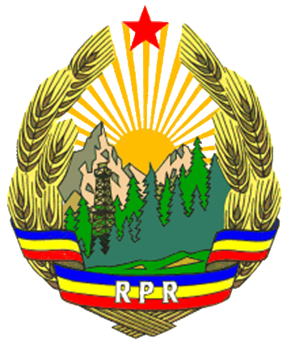

## Titlul 1. Republica Socialistă România

### Articolul 1.

Romania este republica socialista. Republica Socialista Romania este stat al oamenilor muncii de la orase si sate, suveran, independent si unitar. Teritoriul sau este inalienabil si indivizibil.

### Articolul 2.

Intreaga putere in Republica Socialista Romania apartine poporului, liber si stapin pe soarta sa.
Puterea poporului se intemeiaza pe alianta muncitoreasca-taraneasca. In strinsa unire, clasa muncitoare – clasa conducatoare in societate -, taranimea, intelectualitatea, celelalte categorii de oameni ai muncii, fara deosebire de nationalitate, construiesc orinduirea socialista, creind conditiile trecerii la comunism.

### Articolul 3.

In Republica Socialista Romania forta politica conducatoare a intregii societati este Partidul Comunist Roman.

### Articolul 4.

Detinator suveran al puterii, poporul o exercita prin Marea Adunare Nationala si prin consiliile populare, organe alese prin vot universal, egal, direct si secret.
Marea Adunare Nationala si consiliile populare constituie baza intregului sistem de organe ale statului.
Marea Adunare Nationala este organul suprem al puterii de stat, sub conducerea si controlul caruia isi desfasoara activitatea toate celelalte organe ale statului.

### Articolul 5.

Economia nationala a Romaniei este o economie socialista, bazata pe proprietatea socialista asupra mijloacelor de productie.
In Republica Socialista Romania, exploatarea omului de catre om este pentru totdeauna desfiintata si se infaptuieste principiul socialist al repartitiei dupa cantitatea si calitatea muncii.
Munca este o indatorire de onoare pentru fiecare cetatean al tarii.

### Articolul 6.

Proprietatea socialista asupra mijloacelor de productie este fie proprietate de stat – asupra bunurilor apartinind intregului popor, fie proprietate cooperatista – asupra bunurilor apartinind fiecarei organizatii cooperatiste.

### Articolul 7.

Bogatiile de orice natura ale subsolului, minele, terenurile din fondul funciar de stat, padurile, apele, izvoarele de energie naturala, fabricile si uzinele, bancile, intreprinderile agricole de stat, statiunile pentru mecanizarea agriculturii, caile de comunicatie, mijloacele de transport si telecomunicatii de stat, fondul de stat de cladiri si locuinte, baza materiala a institutiilor social-culturale de stat, apartin intregului popor, sint proprietate de stat.

### Articolul 8.

Comertul exterior este monopol de stat.

### Articolul 9.

Pamintul cooperativelor agricole de productie, animalele, uneltele, instalatiile si constructiile ce le apartin sint proprietate cooperatista.
Lotul de pamint aflat, potrivit statutului cooperativelor agricole de productie, in folosinta gospodariilor familiale ale taranilor cooperatori, constituie proprietate cooperatista.
Casa de locuit si constructiile gospodaresti, terenul pe care acestea se afla, precum si, potrivit statutului cooperativelor agricole, animalele de productie si inventarul agricol marunt, constituie proprietate personala a taranilor cooperatori. Uneltele, masinile, instalatiile si constructiile cooperativelor mestesugaresti si ale cooperativelor de productie, achizitii si desfacere a marfurilor sint proprietate cooperatista.

### Articolul 10.

Cooperativele agricole de productie, forma socialista de organizare a agriculturii, asigura conditii pentru cultivarea intensiva a pamintului si aplicarea stiintei inaintate, contribuie, prin sporirea productiei, la dezvoltarea economiei nationale, la ridicarea continua a nivelului de viata al taranimii si al intregului popor.
Statul sprijina cooperativele agricole de productie si ocroteste proprietatea lor. De asemenea, statul sprijina celelalte organizatii cooperatiste si ocroteste proprietatea lor.

### Articolul 11.

In conditiile agriculturii cooperativizate, statul garanteaza taranilor care nu se pot asocia in cooperative agricole de productie proprietatea asupra pamintului pe care il lucreaza ei insisi si familiile lor, asupra uneltelor folosite in acest scop, ca si proprietatea asupra animalelor de munca si de productie.
Este garantata, de asemenea, proprietatea mestesugarilor asupra atelierelor proprii.

### Articolul 12.

Terenurile si constructiile pot fi expropriate numai pentru lucrari de interes obstesc si cu plata unei juste despagubiri.

### Articolul 13.

In Republica Socialista Romania, intreaga activitate de stat are drept scop dezvoltarea orinduirii si inflorirea natiunii socialiste, cresterea continua a bunastarii materiale si culturale a poporului, asigurarea libertatii si demnitatii omului, afirmarea multilaterala a personalitatii umane.
Pentru aceasta, statul socialist roman:
Organizeaza, planifica si conduce economia nationala;
Apara proprietatea socialista;
Garanteaza exercitarea deplina a drepturilor cetatenilor, asigura legalitatea socialista si apara ordinea de drept;
Dezvolta invatamintul de toate gradele, asigura conditiile pentru dezvoltarea stiintei, artei si culturii, infaptuieste ocrotirea sanatatii;
Asigura apararea tarii si organizeaza fortele sale armate;
Organizeaza relatiile cu celelalte state.

### Articolul 14.

Republica Socialista Romania intretine si dezvolta relatii de prietenie si colaborare cu tarile socialiste in spiritul internationalismului socialist, promoveaza relatii de colaborare cu tarile avind alta orinduire social-politica, activeaza in organizatii internationale in scopul asigurarii pacii si intelegerii intre popoare.
Relatiile externe ale Republicii Socialiste Romania se bazeaza pe principiile respectarii suveranitatii si independentei nationale, egalitatii in drepturi si avantajului reciproc, neamestecului in treburile interne.

### Articolul 15.

Teritoriul Republicii Socialiste Romania este organizat in unitati administrativ-teritoriale: judetul, orasul si comuna. Capitala Republicii Socialiste Romania este municipiul Bucuresti, care este organizat pe sectoare.
Orasele mai importante pot fi organizate ca municipii.

### Articolul 16.

Cetatenia romana se dobindeste si se pierde potrivit legii.

## Titlul 2. Drepturile și Îndatoririle Fundamentale ale Cetățenilor

### Articolul 17.

Cetatenii Republicii Socialiste Romania, fara deosebire de nationalitate, rasa, sex sau religie, sint egali in drepturi in toate domeniile vietii economice, politice, juridice, sociale si culturale.
Statul garanteaza egalitatea in drepturi a cetatenilor. Nici o ingradire a acestor drepturi si nici o deosebire in exercitarea lor pe temeiul nationalitatii, rasei, sexului sau religiei nu sint ingaduite.
Orice manifestare avind ca scop stabilirea unor asemenea ingradiri, propaganda nationalist-sovina, atitarea urii de rasa sau nationale, sint pedepsite prin lege.

### Articolul 18.

In Republica Socialista Romania, cetatenii au dreptul la munca. Fiecarui cetatean i se asigura posibilitatea de a desfasura, potrivit pregatirii sale, o activitate in domeniul economic, administrativ, social sau cultural, remunerata dupa cantitatea si calitatea ei. La munca egala retributia este egala.
Prin lege se stabilesc masurile de protectie si securitate a muncii, precum si masuri speciale de ocrotire a muncii femeilor si tineretului.

### Articolul 19.

Cetatenii Republicii Socialiste Romania au dreptul la odihna.
Dreptul la odihna este garantat celor ce muncesc prin stabilirea duratei maxime a zilei de munca la 8 ore, a unui repaus saptaminal si prin concedii anuale platite.
In sectoarele de munca grea si foarte grea, durata zilei de munca este redusa sub 8 ore, fara scaderea retributiei.

### Articolul 20.

Cetatenii Republicii Socialiste Romania au dreptul la asigurare materiala de batrinete, boala sau incapacitate de munca.
Dreptul la asigurare materiala se realizeaza pentru muncitori si functionari prin pensii si ajutoare de boala acordate in cadrul sistemului asigurarilor sociale de stat, iar pentru membrii organizatiilor cooperatiste sau ai altor organizatii obstesti, prin formele de asigurare organizate de acestea. Statul asigura asistenta medicala prin institutiile sale sanitare.
Concediul de maternitate platit este garantat.

### Articolul 21.

Cetatenii Republicii Socialiste Romania au dreptul la invatatura.
Dreptul la invatatura este asigurat prin invatamintul general obligatoriu, prin gratuitatea invatamintului de toate gradele, precum si prin sistemul burselor de stat.
Invatamintul in Republica Socialista Romania este invatamint de stat.

### Articolul 22.

In Republica Socialista Romania, nationalitatilor conlocuitoare li se asigura folosirea libera a limbii materne, precum si carti, ziare, reviste, teatre, invatamintul de toate gradele, in limba proprie. In unitatile administrativ-teritoriale locuite si de populatie de alta nationalitate decit cea romana, toate organele si institutiile folosesc oral si scris si limba nationalitatii respective si fac numiri de functionari din rindul acesteia sau al altor cetateni care cunosc limba si felul de trai al populatiei locale.

### Articolul 23.

In Republica Socialista Romania, femeia are drepturi egale cu barbatul.
Statul ocroteste casatoria si familia si apara interesele mamei si copilului.

### Articolul 24.

Republica Socialista Romania asigura tinerilor conditiile necesare dezvoltarii aptitudinilor lor fizice si intelectuale.

### Articolul 25.

Cetatenii Republicii Socialiste Romania au dreptul de a alege si de a fi alesi in Marea Adunare Nationala si in consiliile populare.
Votul este universal, egal, direct si secret. Au drept de vot toti cetatenii care au implinit virsta de 18 ani.
Cetatenii cu drept de vot care au implinit virsta de 23 de ani pot fi alesi deputati in Marea Adunare Nationala si in consiliile populare.
Dreptul de a depune candidaturi apartine Frontului Democratiei si Unitatii Socialiste, cel mai larg organism politic permanent, revolutionar, democratic, cu caracter reprezentativ, care constituie cadrul organizatoric de unire, sub conducerea Partidului Comunist Roman, a fortelor politice si sociale ale natiunii noastre socialiste, a tuturor organizatiilor de masa si obstesti, pentru participarea intregului popor la infaptuirea politicii interne si externe a partidului si statului, la conducerea tuturor domeniilor de activitate.
Alegatorii au dreptul de a revoca oricind pe deputat potrivit procedurii prevazute de lege.
Nu au dreptul de a alege si de a fi alesi alienatii si debilii mintali, precum si persoanele lipsite de aceste drepturi pe durata stabilita prin hotarire judecatoreasca de condamnare.

### Articolul 26.

Cetatenii cei mai inaintati si mai constienti din rindurile muncitorilor, taranilor, intelectualilor si ale celorlalte categorii de oameni ai muncii se unesc in Partidul Comunist Roman, cea mai inalta forma de organizare a clasei muncitoare, detasamentul ei de avangarda.
Partidul Comunist Roman exprima si slujeste cu fidelitate nazuintele si interesele vitale ale poporului, indeplineste rolul conducator in toate domeniile constructiei socialiste, indruma activitatea organizatiilor de masa si obstesti, precum si a organelor de stat.

### Articolul 27.

Cetatenii Republicii Socialiste Romania au dreptul de a se asocia in organizatii sindicale, cooperatiste, de tineret, de femei, social-culturale, in uniuni de creatie, asociatii stiintifice, tehnice, sportive, precum si in alte organizatii obstesti. Statul sprijina activitatea organizatiilor de masa si obstesti, creeaza conditii pentru dezvoltarea bazei materiale a acestor organizatii si ocroteste patrimoniul lor.
Organizatiile de masa si obstesti asigura larga participare a maselor populare la viata politica, economica, sociala, culturala a Republicii Socialiste Romania si la exercitarea controlului obstesc – expresie a democratismului orindurii socialiste. Prin organizatiile de masa si obstesti, Partidul Comunist Roman infaptuieste o legatura organizata cu clasa muncitoare, taranimea, intelectualitatea si celelalte categorii de oameni ai muncii, le mobilizeaza in lupta pentru desavirsirea constructiei socialismului.

### Articolul 28.

Cetatenilor Republicii Socialiste Romania li se garanteaza libertatea cuvintului, a presei, a intrunirilor, a mitingurilor si a demonstratiilor.

### Articolul 29.

Libertatea cuvintului, presei, intrunirilor, mitingurilor si demonstratiilor nu pot fi folosite in scopuri potrivnice orinduirii socialiste si intereselor celor ce muncesc.
Orice asociatie cu caracter fascist sau antidemocratic este interzisa. Participarea la astfel de asociatii si propaganda cu caracter fascist sau antidemocratic sint pedepsite prin lege.

### Articolul 30.

Libertatea constiintei este garantata tuturor cetatenilor Republicii Socialiste Romania.
Oricine este liber sa impartaseasca sau nu o credinta religioasa. Libertatea exercitarii cultului religios este garantata. Cultele religioase se organizeaza si functioneaza liber. Modul de organizare si functionare a cultelor religioase este reglementat prin lege.
Scoala este despartita de biserica. Nici o confesiune, congregatie sau comunitate religioasa nu poate deschide sau intretine alte institutii de invatamint decit scoli speciale pentru pregatirea personalului de cult.

### Articolul 31.

Cetatenilor Republicii Socialiste Romania le este garantata inviolabilitatea persoanei.
Nici o persoana nu poate fi retinuta sau arestata daca impotriva ei nu exista probe sau indicii temeinice ca a savirsit o fapta prevazuta si pedepsita prin lege. Organele de cercetare pot dispune retinerea unei persoane pe o durata de cel mult 24 de ore.
Nimeni nu poate fi arestat decit pe baza unui mandat de arestare emis de tribunal sau de procuror.
Dreptul de aparare este garantat in tot cursul procesului.

### Articolul 32.

Domiciliul este inviolabil. Nimeni nu poate patrunde in locuinta unei persoane fara invoirea acesteia, decit in cazurile si in conditiile anume prevazute de lege.

### Articolul 33.

Secretul corespondentei si al convorbirilor telefonice este garantat.

### Articolul 34.

Dreptul de petitionare este garantat. Organele de stat au obligatia de a rezolva petitiile cetatenilor privind drepturi si interese personale sau obstesti.

### Articolul 35.

Cel vatamat intr-un drept al sau printr-un act ilegal al unui organ de stat poate cere organelor competente, in conditiile prevazute de lege, anularea actului si repararea pagubei.

### Articolul 36.

Dreptul de proprietate personala este ocrotit de lege.
Pot constitui obiect al dreptului de proprietate personala veniturile si economiile provenite din munca, casa de locuit, gospodaria de pe linga ea si terenul pe care ele se afla, precum si bunurile de uz si confort personal.

### Articolul 37.

Dreptul de mostenire este ocrotit de lege.

### Articolul 38.

Republica Socialista Romania acorda drept de azil cetatenilor straini urmariti pentru activitatea lor in apararea intereselor celor ce muncesc, pentru participarea la lupta de eliberare nationala sau de aparare a pacii.

### Articolul 39.

Fiecare cetatean al Republicii Socialiste Romania este dator sa respecte Constitutia si legile, sa apere proprietatea socialista, sa contribuie la intarirea si dezvoltarea orinduirii socialiste.

### Articolul 40.

Serviciul militar in rindurile fortelor armate ale Republicii Socialiste Romania este obligatoriu si constituie o indatorire de onoare a cetatenilor Republicii Socialiste Romania.

### Articolul 41.

Apararea patriei este datoria sfinta a fiecarui cetatean al Republicii Socialiste Romania. Calcarea juramintului militar, tradarea de patrie, trecerea de partea inamicului, aducerea de prejudicii capacitatii de aparare a statului, constituie crimele cele mai grave fata de popor si sint pedepsite prin lege cu toata asprimea.

## Titlul 3. Organele Supreme ale Puterii de Stat

**Marea Adunare Nationala**

### Articolul 42.

Marea Adunare Nationala, organul suprem al puterii de stat, este unicul organ legiuitor al Republicii Socialiste Romania.

### Articolul 43.

Marea Adunare Nationala are urmatoarele atributii principale:
1. Adopta si modifica Constitutia Republicii Socialiste Romania;
2. Reglementeaza sistemul electoral;
3. Hotaraste consultarea poporului, prin referendum, asupra masurilor de importanta deosebita care privesc interese supreme ale tarii;
4. Adopta planul national unic de dezvoltare economico-sociala, bugetul de stat si contul general de incheiere a exercitiului bugetar;
5. Organizeaza Consiliul de Ministri; stabileste normele generale de organizare si functionare a ministerelor si celorlalte organe centrale de stat;
6. Reglementeaza organizarea judecatoreasca si a Procuraturii;
7. Stabileste normele de organizare si functionare a consiliilor populare;
8. Stabileste organizarea administrativa a teritoriului;
9. Acorda amnistia;
10. Ratifica si denunta tratatele internationale care implica modificarea legilor;
11. Alege si revoca pe Presedintele Republicii Socialiste Romania;
12. Alege si revoca Consiliul de Stat;
13. Alege si revoca Consiliul de Ministri;
14. Alege si revoca Tribunalul Suprem si procurorul general;
15. Exercita controlul general al aplicarii Constitutiei. Numai Marea Adunare Nationala hotaraste asupra constitutionalitatii legilor;
16. Controleaza activitatea Presedintelui Republicii Socialiste Romania si a Consiliului de Stat;
17. Controleaza activitatea Consiliului de Ministri, a ministerelor si a celorlalte organe centrale ale administratiei de stat;
18. Asculta dari de seama cu privire la activitatea Tribunalului Suprem si controleaza deciziile sale de indrumare;
19. Controleaza activitatea Procuraturii;
20. Exercita controlul general asupra activitatii consiliilor populare;
21. Stabileste linia generala a politicii externe;
22. Proclama, in interesul apararii tarii, a ordinii publice sau a securitatii statului, starea de necesitate, in unele localitati sau pe intreg teritoriul tarii;
23. Declara mobilizarea partiala sau generala;
24. Declara starea de razboi. Starea de razboi poate fi declarata numai in cazul unei agresiuni armate impotriva Republicii Socialiste Romania sau impotriva unui alt stat fata de care Republica Socialista Romania are obligatii de aparare mutuala asumate prin tratate internationale, daca s-a produs situatia pentru care obligatia de declarare a starii de razboi este statornicita.

### Articolul 44.

Deputatii Marii Adunari Nationale se aleg pe circumscriptii electorale avind acelasi numar de locuitori.
Norma de reprezentare pentru alegerea deputatilor si delimitarea circumscriptiilor electorale se stabilesc prin decret al Consiliului de Stat.
In fiecare circumscriptie electorala se alege un deputat.

### Articolul 45.

Marea Adunare Nationala se alege pentru o legislatura de 5 ani.
Mandatul Marii Adunari Nationale nu poate inceta inainte de incheierea legislaturii pentru care a fost aleasa. Mandatul inceteaza la data efectuarii alegerilor pentru noua Mare Adunare Nationala.
In cazul cind constata existenta unor imprejurari care fac imposibila efectuarea alegerilor, Marea Adunare Nationala poate hotari prelungirea mandatului sau pe durata acestor imprejurari.

### Articolul 46.

Alegerile pentru Marea Adunare Nationala au loc in una din zilele nelucratoare ale lunii martie a anului in care se incheie legislatura precedenta. In cazul prevazut la [Art. 45 alin. 3](#articolul-45), alegerile au loc in decurs de 2 luni de la expirarea termenului pentru care a fost prelungit mandatul Marii Adunari Nationale.
Marea Adunare Nationala nou aleasa este convocata in cursul urmatoarelor 3 luni de la incetarea mandatului Marii Adunari Nationale precedente.

### Articolul 47.

Marea Adunare Nationala verifica legalitatea alegerii fiecarui deputat, hotarind validarea sau anularea alegerii.
In cazul anularii unei alegeri, drepturile si datoriile deputatului inceteaza din momentul anularii.

### Articolul 48.

Marea Adunare Nationala adopta regulamentul sau de functionare.

### Articolul 49.

Marea Adunare Nationala isi stabileste anual bugetul, care se inscrie in bugetul de stat.

### Articolul 50.

Marea Adunare Nationala alege, pe durata legislaturii, Biroul Marii Adunari Nationale, alcatuit din presedintele Marii Adunari Nationale si patru vicepresedinti.

### Articolul 51.

Presedintele Marii Adunari Nationale conduce lucrarile sesiunilor Marii Adunari Nationale.
Presedintele Marii Adunari Nationale poate desemna pe oricare dintre vicepresedinti pentru indeplinirea unora din atributiile sale.

### Articolul 52.

Marea Adunare Nationala alege, dintre deputati, comisii permanente.
Comisiile permanente examineaza si dezbat, din insarcinarea Marii Adunari Nationale sau a Consiliului de Stat, proiecte de legi, de decrete, de hotariri sau de alte acte ce urmeaza a fi adoptate, precum si orice alte probleme.
De asemenea, din insarcinarea Marii Adunari Nationale sau a Consiliului de Stat, comisiile permanente asculta, periodic sau pe probleme, fiecare potrivit competentei sale, rapoarte ale conducatorilor oricaror organe ale administratiei de stat, ale Tribunalului Suprem si ale Procuraturii, asupra activitatii acestor organe, precum si ale presedintilor comitetelor executive sau ai birourilor executive ale consiliilor populare asupra activitatii acestor consilii, si analizeaza modul in care organele mentionate infaptuiesc politica Partidului Comunist Roman si asigura aplicarea legii.
Comisiile intocmesc rapoarte, avize sau propuneri in legatura cu toate problemele mentionate in alin. 2 si 3, pe care le supun Marii Adunari Nationale sau Consiliului de Stat.
Marea Adunare Nationala poate alege comisii temporare pentru orice probleme sau domenii de activitate, stabilind imputernicirile si modul de activitate pentru fiecare dintre aceste comisii.
Toate organele si functionarii de stat au obligatia sa puna la dispozitia comisiilor Marii Adunari Nationale informatiile si documentele cerute.

### Articolul 53.

In exercitarea controlului constitutionalitatii legilor, precum si pentru pregatirea lucrarilor privind adoptarea legilor, Marea Adunare Nationala alege pe durata legislaturii o comisie constitutionala si juridica.
In Comisia constitutionala si juridica pot fi alesi – fara a depasi o treime din numarul total al membrilor comisiei – specialisti care nu sint deputati.
Comisia constitutionala si juridica prezinta Marii Adunari Nationale rapoarte sau avize cu privire la constitutionalitatea legilor. De asemenea, examineaza constitutionalitatea decretelor cuprinzind norme cu putere de lege si a hotaririlor Consiliului de Ministri, potrivit Regulamentului de functionare a Marii Adunari Nationale. Dispozitiile [Art. 52](#articolul-52) se aplica, in mod corespunzator, si Comisiei constitutionale si juridice.

### Articolul 54.

Marea Adunare Nationala lucreaza in sesiuni.
Sesiunile ordinare ale Marii Adunari Nationale se convoaca de doua ori pe an, la propunerea Biroului Marii Adunari Nationale. Marea Adunare Nationala se convoaca, ori de cite ori este nevoie, in sesiuni extraordinare, din initiativa Consiliului de Stat, a Biroului Marii Adunari Nationale sau cel putin a unei treimi din numarul total al deputatilor.
Convocarea in sesiuni a Marii Adunari Nationale se face prin decret al Consiliului de Stat.

### Articolul 55.

Marea Adunare Nationala lucreaza numai daca sint prezenti cel putin jumatate plus unu din numarul total al deputatilor.

### Articolul 56.

Marea Adunare Nationala adopta legi si hotariri.
Legile si hotaririle sint adoptate daca intrunesc votul majoritatii deputatilor Marii Adunari Nationale.
Constitutia se adopta si se modifica cu votul a cel putin doua treimi din numarul total al deputatilor Marii Adunari Nationale. Legile si hotaririle Marii Adunari Nationale se semneaza de presedintele sau vicepresedintele Marii Adunari Nationale care a condus sedinta.

### Articolul 57.

Dupa adoptarea lor de catre Marea Adunare Nationala, legile se publica in Buletinul Oficial al Republicii Socialiste Romania, in termen de cel mult 10 zile, sub semnatura Presedintelui Republicii Socialiste Romania.

### Articolul 58.

Fiecare deputat al Marii Adunari Nationale are dreptul de a pune intrebari si de a adresa interpelari Consiliului de Ministri sau oricaruia dintre membrii acestuia.
Deputatul, in cadrul controlului exercitat de Marea Adunare Nationala, poate pune intrebari si adresa interpelari presedintelui Tribunalului Suprem si procurorului general.
Cel intrebat ori interpelat are obligatia de a raspunde verbal sau in scris, in termen de cel mult 3 zile si in orice caz in aceeasi sesiune.

### Articolul 59.

In vederea pregatirii dezbaterilor Marii Adunari Nationale ori a interpelarilor, deputatul are dreptul sa ceara informatiile necesare de la orice organ de stat, adresindu-se in acest scop Biroului Marii Adunari Nationale.

### Articolul 60.

Fiecare deputat este obligat sa prezinte periodic alegatorilor dari de seama asupra activitatii sale si a Marii Adunari Nationale.

### Articolul 61.

Nici un deputat al Marii Adunari Nationale nu poate fi retinut, arestat sau trimis in judecata penala, fara incuviintarea prealabila a Marii Adunari Nationale in timpul sesiunii, iar intre sesiuni, a Consiliului de Stat.
Numai in caz de infractiune flagranta, deputatul poate fi retinut fara aceasta incuviintare.
Consiliul de Stat

### Articolul 62.

Consiliul de Stat al Republicii Socialiste Romania este organ suprem al puterii de stat cu activitate permanenta, subordonat Marii Adunari Nationale.

### Articolul 63.

Consiliul de Stat exercita in mod permanent urmatoarele atributii principale:
1. Stabileste data alegerilor pentru Marea Adunare Nationala si consiliile populare;
2. Stabileste modul de organizare si desfasurare a referendumului;
3. Organizeaza ministerele si celelalte organe centrale de stat;
4. Ratifica si denunta tratatele internationale, cu exceptia acelora a caror ratificare este de competenta Marii Adunari Nationale;
5. Stabileste gradele militare;
6. Instituie decoratiile si titlurile de onoare.

### Articolul 64.

Consiliul de Stat exercita, in intervalul dintre sesiunile Marii Adunari Nationale, urmatoarele atributii principale:
1. Stabileste, fara a putea sa modifice Constitutia, norme cu putere de lege. Normele cu putere de lege se supun, la prima sesiune, dezbaterii Marii Adunari Nationale, potrivit procedurii de adoptare a legilor. Planul national unic de dezvoltare economico-sociala, bugetul de stat, precum si contul general de incheiere a exercitiului bugetar, pot fi adoptate de Consiliul de Stat numai atunci cind Marea Adunare Nationala nu se poate intruni din cauza unor imprejurari exceptionale;
2. Numeste si revoca pe primul-ministru;
3. Numeste si revoca Consiliul de Ministri si Tribunalul Suprem, atunci cind Marea Adunare Nationala nu se poate intruni din cauza unor imprejurari exceptionale;
4. Da legilor in vigoare interpretarea general-obligatorie;
5. Acorda amnistia;
6. Controleaza aplicarea legilor si hotaririlor Marii Adunari Nationale, activitatea Consiliului de Ministri, a ministerelor si a celorlalte organe centrale ale administratiei de stat, precum si activitatea Procuraturii; asculta dari de seama ale Tribunalului Suprem si controleaza deciziile sale de indrumare; controleaza hotaririle consiliilor populare;
7. Declara, in caz de urgenta, mobilizarea partiala sau generala;
8. Declara, in caz de urgenta, starea de razboi. Starea de razboi poate fi declarata numai in cazul unei agresiuni armate impotriva Republicii Socialiste Romania sau impotriva unui alt stat fata de care Republica Socialista Romania are obligatii de aparare mutuala asumate prin tratate internationale, daca s-a produs situatia pentru care obligatia de declarare a starii de razboi este statornicita.
Atributiile prevazute in prezentul articol pot fi exercitate de Consiliul de Stat si in timpul sesiunilor Marii Adunari Nationale, in cazul in care necesitatile economice si sociale impun adoptarea neintirziata a unor masuri, iar Marea Adunare Nationala nu se afla intrunita in plenul sau; normele cu putere de lege adoptate se supun dezbaterii Marii Adunari Nationale, potrivit procedurii de adoptare a legilor, la reluarea lucrarilor in plen.

### Articolul 65.

Consiliul de Stat este ales de Marea Adunare Nationala dintre membrii sai, pe durata legislaturii, in prima sesiune a acesteia. Consiliul de Stat functioneaza pina la alegerea noului Consiliu de Stat in legislatura urmatoare.

### Articolul 66.

Presedintele Republicii Socialiste Romania este Presedinte al Consiliului de Stat.

### Articolul 67.

Consiliul de Stat se compune din presedinte, vicepresedinti si membri.

### Articolul 68.

Consiliul de Stat isi desfasoara activitatea potrivit principiului conducerii colective.

### Articolul 69.

Consiliul de Stat emite decrete si adopta hotariri.
Decretele si hotaririle se semneaza de Presedintele Republicii Socialiste Romania. Decretele normative se publica in Buletinul Oficial al Republicii Socialiste Romania.

### Articolul 70.

Consiliul de Stat prezinta Marii Adunari Nationale dari de seama cu privire la exercitarea atributiilor sale, precum si la respectarea si executarea, in activitatea de stat, a legilor si hotaririlor Marii Adunari Nationale.
Consiliul de Stat, in intregul sau, si fiecare din membrii acestuia sint raspunzatori in fata Marii Adunari Nationale pentru intreaga activitate a Consiliului de Stat.

**Presedintele Republicii Socialiste Romania**

### Articolul 71.

Presedintele Republicii Socialiste Romania este seful statului si reprezinta puterea de stat in relatiile interne si internationale ale Republicii Socialiste Romania.

### Articolul 72.

Presedintele Republicii Socialiste Romania este ales de Marea Adunare Nationala pe durata legislaturii, in prima sesiune a acesteia, si ramine in functie pina la alegerea presedintelui in legislatura urmatoare.

### Articolul 73.

La alegerea sa, Presedintele Republicii Socialiste Romania depune in fata Marii Adunari Nationale urmatorul juramint:
“Jur sa slujesc cu credinta patria, sa actionez cu fermitate pentru apararea independentei, suveranitatii si integritatii tarii, pentru bunastarea si fericirea intregului popor, pentru edificarea socialismului si comunismului in Republica Socialista Romania!
Jur sa respect si sa apar Constitutia si legile tarii, sa fac totul pentru aplicarea consecventa a principiilor democratiei socialiste, pentru afirmarea in viata societatii a normelor eticii si echitatii socialiste!
Jur sa promovez neabatut politica externa de prietenie si alianta cu toate tarile socialiste, de colaborare cu toate natiunile lumii, fara deosebire de orinduire sociala, pe baza deplinei egalitati in drepturi, de solidaritate cu fortele revolutionare, progresiste, de pretutindeni, de pace si prietenie intre popoare!
Jur ca imi voi face intotdeauna datoria cu cinste si devotament pentru stralucirea si maretia natiunii noastre socialiste, a Republicii Socialiste Romania!”

### Articolul 74.

Presedintele Republicii Socialiste Romania este comandantul suprem al fortelor armate si presedintele Consiliului Apararii Republicii Socialiste Romania.

### Articolul 75.

Presedintele Republicii Socialiste Romania indeplineste, in conformitate cu Constitutia si cu legile, urmatoarele atributii principale:
1. Prezideaza Consiliul de Stat;
2. Prezideaza sedintele Consiliului de Ministri atunci cind apare necesar;
3. Stabileste masurile de importanta deosebita ce privesc interese supreme ale tarii, care urmeaza a fi supuse de catre Marea Adunare Nationala spre consultare poporului, prin referendum;
4. Numeste si revoca, la propunerea primului-ministru, pe viceprim-ministrii, ministrii si presedintii altor organe centrale ale administratiei de stat, care fac parte din Consiliul de Ministri; numeste si revoca pe conducatorii organelor centrale de stat, care nu fac parte din Consiliul de Ministri; numeste si revoca pe membrii Tribunalului Suprem;
5. In timpul in care Marea Adunare Nationala nu este intrunita in plenul sau, numeste si revoca pe presedintele Tribunalului Suprem si pe procurorul general;
6. Acorda gradele de general, amiral si maresal;
7. Confera decoratiile si titlurile de onoare; autoriza purtarea decoratiilor conferite de alte state;
8. Acorda gratierea;
9. Acorda cetatenia, aproba renuntarea la cetatenie si retrage cetatenia romana; aproba stabilirea domiciliului in Romania pentru cetatenii altor state;
10. Acorda dreptul de azil;
11. Stabileste rangurile misiunilor diplomatice, acrediteaza si recheama reprezentantii diplomatici ai Republicii Socialiste Romania;
12. Primeste scrisorile de acreditare si de rechemare ale reprezentantilor diplomatici ai altor state;
13. Incheie tratate internationale in numele Republicii Socialiste Romania; poate da imputerniciri, in acest scop, primului-ministru ori unor membri ai Consiliului de Ministri sau unor reprezentanti diplomatici;
14. In interesul apararii Republicii Socialiste Romania, al asigurarii ordinii publice sau securitatii statului, proclama, in caz de urgenta, in unele localitati sau pe intreg teritoriul tarii, starea de necesitate.
In indeplinirea atributiilor sale, Presedintele Republicii Socialiste Romania emite decrete prezidentiale si decizii.

### Articolul 76.

Presedintele Republicii Socialiste Romania este raspunzator fata de Marea Adunare Nationala pentru intreaga sa activitate.
Presedintele Republicii Socialiste Romania prezinta periodic Marii Adunari Nationale dari de seama asupra exercitarii atributiilor sale si asupra dezvoltarii statului.

## Titlul 4. Organele Centrale ale Administrației de Stat

### Articolul 77.

Consiliul de Ministri este organul suprem al administratiei de stat.
Consiliul de Ministri exercita conducerea generala a activitatii executive pe intreg teritoriul tarii, avind urmatoarele atributii principale:
1. Stabileste masuri generale pentru aducerea la indeplinire a politicii interne si externe;
2. Hotaraste masurile necesare privind organizarea si asigurarea executarii legilor;
3. Conduce, coordoneaza si controleaza activitatea ministerelor si a celorlalte organe centrale ale administratiei de stat;
4. Elaboreaza proiectul planului national unic de dezvoltare economico-sociala si proiectul bugetului de stat, precum si orice alte proiecte de legi; elaboreaza proiecte de decrete;
5. Stabileste masuri pentru realizarea planului national unic de dezvoltare economico-sociala si a bugetului de stat; intocmeste raportul general cu privire la indeplinirea planului national unic de dezvoltare economico-sociala si contul general de incheiere a exercitiului bugetar;
6. Infiinteaza organizatii economice, intreprinderi si institutii de stat de interes republican;
7. Ia masuri in vederea asigurarii ordinii publice, apararii intereselor statului si ocrotirii drepturilor cetatenilor;
8. Ia masuri, potrivit hotaririlor Consiliului Apararii, pentru organizarea generala a fortelor armate si fixarea contingentelor anuale de cetateni care urmeaza sa fie chemati la indeplinirea serviciului militar;
9. Exercita conducerea generala in domeniul relatiilor cu alte state si ia masuri pentru incheierea acordurilor internationale;
10. Sprijina activitatea organizatiilor de masa si obstesti;
11. Exercita, in conditiile prevazute de lege, atributiile sale de conducere si de control asupra activitatii comitetelor executive si birourilor executive ale consiliilor populare.

### Articolul 78.

Consiliul de Ministri este ales de Marea Adunare Nationala pe durata legislaturii, in prima sesiune a acesteia.
Consiliul de Ministri functioneaza pina la alegerea noului Consiliu de Ministri in legislatura urmatoare.

### Articolul 79.

In indeplinirea atributiilor sale, Consiliul de Ministri adopta hotariri pe baza si in vederea executarii legilor.
Hotaririle cu caracter normativ se publica in Buletinul Oficial al Republicii Socialiste Romania.

### Articolul 80.

Consiliul de Ministri se compune din: primul-ministru, viceprim-ministrii, ministrii, ministrii secretari de stat, precum si presedintii altor organe centrale ale administratiei de stat prevazuti prin lege.
Din Consiliul de Ministri fac parte, de asemenea, ca membri, presedintele Consiliului Central al Uniunii Generale a Sindicatelor, presedintele Uniunii Nationale a Cooperativelor Agricole de Productie, presedinta Consiliului National al Femeilor si primul-secretar al Comitetului Central al Uniunii Tineretului Comunist.
Consiliul de Ministri poate sa-si constituie un Birou Executiv pentru rezolvarea operativa a problemelor curente si urmarirea executarii hotaririlor Consiliului de Ministri.

### Articolul 81.

Consiliul de Ministri isi desfasoara activitatea potrivit principiului conducerii colective, asigurind unitatea de actiune politica si administrativa a ministerelor si a celorlalte organe centrale ale administratiei de stat.

### Articolul 82.

Consiliul de Ministri, in intregul sau, si fiecare din membrii acestuia sint raspunzatori in fata Marii Adunari Nationale, iar in intervalul dintre sesiuni, in fata Consiliului de Stat. Fiecare membru al Consiliului de Ministri este raspunzator atit pentru propria sa activitate, cit si pentru intreaga activitate a Consiliului de Ministri.

### Articolul 83.

Ministerele si celelalte organe centrale ale administratiei de stat infaptuiesc politica statului in ramurile sau domeniile de activitate pentru care au fost infiintate.
Ele conduc, indruma si controleaza intreprinderile, organizatiile economice si institutiile de stat din subordinea lor.

### Articolul 84.

Ministrii si conducatorii celorlalte organe centrale ale administratiei de stat emit, pe baza si in vederea executarii legilor si hotaririlor Consiliului de Ministri, instructiuni si ordine, precum si alte acte prevazute de lege; actele lor cu caracter normativ se publica in Buletinul Oficial al Republicii Socialiste Romania.

### Articolul 85.

Ministrii si conducatorii celorlalte organe centrale ale administratiei de stat raspund de activitatea organelor pe care le conduc in fata Consiliului de Ministri.

## Titlul 5. Organele Locale ale Puterii de Stat și Organele Locale ale Administrației de Stat

### Articolul 86.

Consiliile populare sint organele locale ale puterii de stat in unitatile administrativ-teritoriale in care au fost alese.
Consiliile populare conduc activitatea locala, asigurind dezvoltarea economica, social-culturala si edilitar-gospodareasca a unitatilor administrativ-teritoriale in care au fost alese, apararea proprietatii socialiste, ocrotirea drepturilor cetatenilor, legalitatea socialista si mentinerea ordinii publice.
Consiliile populare organizeaza participarea cetatenilor la rezolvarea pe plan local a treburilor de stat si obstesti.

### Articolul 87.

Consiliul popular exercita urmatoarele atributii principale:
1. Adopta planul economic si bugetul local, aproba contul de incheiere a exercitiului bugetar;
2. Alege si revoca comitetul executiv sau, dupa caz, biroul executiv;
3. Infiinteaza organizatii economice, intreprinderi si institutii de stat de interes local;
4. Conduce, indruma si controleaza activitatea comitetului executiv sau, dupa caz, a biroului executiv, a organelor locale de specialitate ale administratiei de stat, a organizatiilor economice, intreprinderilor si institutiilor subordonate;
5. Controleaza hotaririle consiliilor populare ierarhic inferioare;
6. Alege si revoca, potrivit legii, judecatorii, asesorii populari si procurorul sef al judetului sau al municipiului Bucuresti.

### Articolul 88.

Consiliile populare sint alcatuite din deputati alesi pe circumscriptii electorale, cite un deputat pentru fiecare circumscriptie.
Circumscriptiile electorale formate pentru alegerea deputatilor unui consiliu popular au acelasi numar de locuitori.
Durata mandatului consiliilor populare judetene si al municipiului Bucuresti este de 5 ani, iar al consiliilor populare municipale, ale sectoarelor municipiului Bucuresti, orasenesti si comunale este de 2 ani si jumatate.
Data alegerilor pentru consiliile populare se stabileste potrivit legii.

### Articolul 89.

Consiliile populare aleg, dintre deputati, comisii permanente, care le sprijina in indeplinirea sarcinilor lor.

### Articolul 90.

Consiliile populare lucreaza in sesiuni; convocarea in sesiuni se face de comitetul executiv sau, dupa caz, de biroul executiv al consiliului popular.
Consiliile populare se convoaca ori de cite ori este nevoie in sesiuni extraordinare, din initiativa comitetului executiv sau, dupa caz, a biroului executiv, sau a cel putin unei treimi din numarul total al deputatilor.

### Articolul 91.

Consiliile populare lucreaza in prezenta a cel putin jumatate plus unu din numarul total al deputatilor.

### Articolul 92.

Fiecare deputat este obligat sa prezinte periodic alegatorilor dari de seama asupra activitatii sale si a consiliului popular in care a fost ales.

### Articolul 93.

Consiliile populare adopta hotariri.
O hotarire este adoptata daca intruneste votul majoritatii deputatilor consiliului popular.
Hotaririle cu caracter normativ se aduc la cunostinta cetatenilor in formele prevazute prin lege.

### Articolul 94.

Comitetul executiv al consiliului popular si biroul executiv al consiliului popular sint organe locale ale administratiei de stat cu competenta generala in unitatea administrativ-teritoriala in care a fost ales consiliul popular.

### Articolul 95.

Comitetul executiv al consiliului popular si biroul executiv al consiliului popular au urmatoarele atributii principale:
1. Aduc la indeplinire legile, decretele, precum si hotaririle Consiliului de Ministri si celelalte acte ale organelor superioare;
2. Executa hotaririle consiliilor populare care le-au ales;
3. Elaboreaza proiectele de plan economic si de buget local;
4. Executa planul economic si bugetul local, intocmesc raportul cu privire la indeplinirea planului economic local, precum si contul de incheiere a exercitiului bugetar;
5. Conduc, indruma si controleaza activitatea organelor locale de specialitate ale administratiei de stat;
6. Conduc, indruma, coordoneaza si controleaza activitatea organizatiilor economice, a intreprinderilor si institutiilor subordonate;
7. Conduc, indruma si controleaza activitatea comitetelor executive sau, dupa caz, a birourilor executive ale consiliilor populare ierarhic inferioare consiliilor populare care le-au ales.
In intervalul dintre sesiunile consiliului popular, comitetul executiv sau, dupa caz, biroul executiv indeplineste si atributiile acestuia, cu exceptia celor prevazute la [Art. 87 pct. 1, 2, 4, 5 si 6](#articolul-87), supunind deciziile adoptate ratificarii consiliului popular la prima sa sesiune.

### Articolul 96.

Consiliile populare judetene, al municipiului Bucuresti, ale sectoarelor acestuia, precum si cele ale municipiilor, aleg comitete executive, iar consiliile populare ale oraselor si comunelor aleg birouri executive.
Comitetul executiv sau biroul executiv este ales dintre deputatii consiliului popular la prima sesiune dupa alegeri, pe durata mandatului acelui consiliu.
Dupa expirarea mandatului consiliului popular, comitetul executiv sau, dupa caz, biroul executiv continua sa functioneze pina la alegerea noului comitet sau birou executiv.

### Articolul 97.

Comitetul executiv sau biroul executiv al consiliului popular este alcatuit, potrivit legii, din presedinte, unul sau mai multi vicepresedinti si alti membri.

### Articolul 98.

In exercitarea atributiilor sale, comitetul executiv sau biroul executiv al consiliului popular emite decizii pe baza si in vederea executarii legii.
Deciziile cu caracter normativ se aduc la cunostinta cetatenilor in formele prevazute prin lege.

### Articolul 99.

Comitetul executiv si biroul executiv isi desfasoara activitatea potrivit principiului conducerii colective.
Comitetul executiv sau biroul executiv in intregul sau si fiecare din membrii acestuia sint raspunzatori in fata consiliului popular care i-a ales, precum si in fata comitetului executiv sau a biroului executiv al consiliului popular ierarhic superior si a Consiliului de Ministri.
Fiecare membru al comitetului executiv sau al biroului executiv este raspunzator atit pentru propria sa activitate, cit si pentru intreaga activitate a organului din care face parte.

### Articolul 100.

Consiliile populare organizeaza, potrivit legii, pe linga comitetele lor executive sau, dupa caz, birourile executive, organe locale de specialitate ale administratiei de stat. Organele locale de specialitate ale administratiei de stat sint subordonate atit consiliului popular si comitetului executiv sau, dupa caz, biroului executiv, cit si organelor locale si centrale ale administratiei de stat ierarhic superioare.

## Titlul 6. Organele Judecătorești

### Articolul 101.

In Republica Socialista Romania justitia se infaptuieste, potrivit legii, prin Tribunalul Suprem, tribunalele judetene, judecatorii, precum si prin tribunalele militare.

### Articolul 102.

Prin activitatea de judecata, tribunalele si judecatoriile apara orinduirea socialista si drepturile persoanelor, educind cetatenii in spiritul respectarii legilor.
Tribunalele si judecatoriile, aplicind sanctiuni penale, urmaresc indreptarea si reeducarea infractorilor, precum si prevenirea savirsirii de noi infractiuni.

### Articolul 103.

Tribunalele si judecatoriile judeca pricinile civile, penale si orice alte pricini date in competenta lor.
In cazurile prevazute prin lege, tribunalele si judecatoriile exercita controlul asupra hotaririlor organelor administrative sau obstesti cu activitate jurisdictionala.
Tribunalele si judecatoriile judeca cererile celor vatamati in drepturile lor prin acte administrative, putind sa se pronunte, in conditiile legii, si asupra legalitatii acestor acte.

### Articolul 104.

Tribunalul Suprem exercita controlul general asupra activitatii de judecata a tuturor tribunalelor si judecatoriilor.
Modul de exercitare a acestui control se stabileste prin lege.
In vederea aplicarii unitare a legilor in activitatea de judecata, Tribunalul Suprem emite, in plenul sau, decizii de indrumare.

### Articolul 105.

Tribunalul Suprem este ales de Marea Adunare Nationala pe durata legislaturii, in prima sesiune a acesteia.
Tribunalul Suprem functioneaza pina la alegerea noului Tribunal Suprem in legislatura urmatoare.

### Articolul 106.

Tribunalul Suprem raspunde pentru activitatea sa in fata Marii Adunari Nationale, iar intre sesiuni, in fata Consiliului de Stat.

### Articolul 107.

Organizarea judecatoriilor si a tribunalelor, competenta lor si procedura de judecata sint stabilite prin lege.
Judecarea proceselor in prima instanta la judecatorii, la tribunalele judetene si la tribunalele militare se face cu participarea asesorilor populari, afara de cazurile cind legea dispune altfel.

### Articolul 108.

Judecatorii si asesorii populari sint alesi in conformitate cu procedura stabilita prin lege.

### Articolul 109.

In Republica Socialista Romania procedura judiciara se face in limba romana, asigurindu-se, in unitatile administrativ-teritoriale locuite si de populatie de alta nationalitate decit cea romana, folosirea limbii materne a acelei populatii. Partilor care nu vorbesc limba in care se face procedura judiciara li se asigura posibilitatea de a lua cunostinta, prin traducator, de piesele dosarului, precum si dreptul de a vorbi in instanta si a pune concluzii in limba materna.

### Articolul 110.

Judecata se desfasoara in sedinta publica, cu exceptia cazurilor prevazute prin lege.

### Articolul 111.

In activitatea de judecata, judecatorii si asesorii populari sint independenti si se supun numai legii.

## Titlul 7. Organele Procuraturii

### Articolul 112.

Procuratura Republicii Socialiste Romania exercita supravegherea activitatii organelor de urmarire penala si a organelor de executare a pedepselor si vegheaza, in conditiile legii, la respectarea legalitatii, apararea orinduirii socialiste, a drepturilor si intereselor legitime ale organizatiilor socialiste, ale celorlalte persoane juridice, precum si ale cetatenilor.

### Articolul 113.

Procuratura este condusa de procurorul general. Organele Procuraturii sint: Procuratura Generala, procuraturile judetene, procuraturile locale si procuraturile militare.
Organele Procuraturii sint subordonate ierarhic.

### Articolul 114.

Procurorul general este ales de Marea Adunare Nationala pe durata legislaturii, in prima sesiune a acesteia, si functioneaza pina la alegerea noului procuror general in prima sesiune a legislaturii urmatoare.
Procurorii sint numiti potrivit legii, cu exceptia celor prevazuti in [Art. 87 pct. 6](#articolul-87).

### Articolul 115.

Procurorul general raspunde in fata Marii Adunari Nationale de activitatea Procuraturii, iar in intervalul dintre sesiuni, in fata Consiliului de Stat.

## Titlul 8. Însemnele Republicii Socialiste România

### Articolul 116.

Stema Republicii Socialiste Romania reprezinta munti impaduriti, deasupra carora se ridica soarele. In partea stinga a stemei se afla o sonda. Stema este incadrata de o cununa de spice de griu. In partea de sus a stemei se afla o stea in cinci colturi. In partea de jos a stemei, spicele sint infasurate intr-o panglica tricolora pe care este scris "Republica Socialistă România"

### Articolul 117.

Pe sigiliul statului este reprezentata stema tarii, in jurul careia este scris "Republica Socialistă România"

### Articolul 118.

Drapelul Republicii Socialiste Romania poarta culorile rosu, galben si albastru, asezate vertical, cu albastrul linga lance. In mijloc este asezata stema Republicii Socialiste Romania.

### Articolul 119.

Imnul de stat al Republicii Socialiste Romania se aproba de catre Marea Adunare Nationala.

## Titlul 9. Dispoziții Finale

### Articolul 120.

Prezenta Constitutie intra in vigoare la data adoptarii ei.

### Articolul 121.

Constitutia din 24 septembrie 1952, precum si orice dispozitii din legi, decrete si alte acte normative, contrarii prevederilor prezentei Constitutii, sint abrogate la aceeasi data.