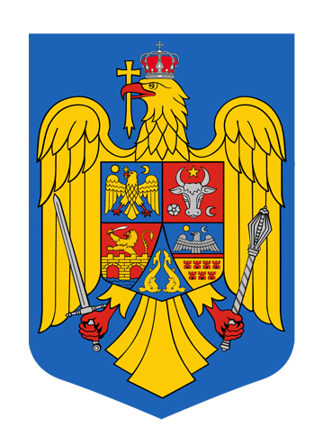

## Titlul 1. Principii generale

##### Articolul 1. Statul român

1. România este stat naţional, suveran şi independent, unitar şi indivizibil.
2. Forma de guvernământ a statului român este republica.
3. România este stat de drept, democratic şi social, în care demnitatea omului, drepturile şi libertăţile cetăţenilor, libera dezvoltare a personalităţii umane, dreptatea şi pluralismul politic reprezintă valori supreme şi sunt garantate.

##### Articolul 2. Suveranitatea

1. Suveranitatea naţională aparţine poporului român, care o exercită prin organele sale reprezentative şi prin referendum.
2. Nici un grup şi nici o persoană nu pot exercita suveranitatea în nume propriu.

##### Articolul 3. Teritoriul

1. Teritoriul României este inalienabil.
2. Frontierele ţării sunt consfinţite prin lege organică, cu respectarea principiilor şi a celorlalte norme general admise ale dreptului internaţional.
3. Teritoriul este organizat, sub aspect administrativ, în comune, oraşe şi judeţe. în condiţiile legii, unele oraşe sunt declarate municipii.
4. Pe teritoriul statului român nu pot fi strămutate sau colonizate populaţii străine.

##### Articolul 4. Unitatea poporului şi egalitatea între cetăţeni

1. Statul are ca fundament unitatea poporului român.
2. România este patria comună şi indivizibilă a tuturor cetăţenilor săi, fără deosebire de rasă, de naţionalitate, de origine etnică, de limbă, de religie, de sex, de opinie, de apartenenţă politică, de avere sau de origine socială.

##### Articolul 5. Cetăţenia

1. Cetăţenia română se dobândeşte, se păstrează sau se pierde în condiţiile prevăzute de legea organică.
2. Cetăţenia română nu poate fi retrasă aceluia care a dobândit-o prin naştere.

##### Articolul 6. Dreptul la identitate

1. Statul recunoaşte şi garantează persoanelor aparţinând minorităţilor naţionale dreptul la păstrarea, la dezvoltarea şi la exprimarea identităţii lor etnice, culturale, lingvistice şi religioase.
2. Măsurile de protecţie luate de stat pentru păstrarea, dezvoltarea şi exprimarea identităţii persoanelor aparţinând minorităţilor naţionale trebuie să fie conforme cu principiile de egalitate şi de nediscriminare în raport cu ceilalţi cetăţeni români.

##### Articolul 7. Românii din străinătate

Statul sprijină întărirea legăturilor cu românii din afară frontierelor ţării şi acţionează pentru păstrarea, dezvoltarea şi exprimarea identităţii lor etnice, culturale, lingvistice şi religioase, cu respectarea legislaţiei statului ai cărui cetăţeni sunt.

##### Articolul 8. Pluralismul şi partidele politice

1. Pluralismul în societatea românească este o condiţie şi o garanţie a democraţiei constituţionale.
2. Partidele politice se constituie şi îşi desfăşoara activitatea în condiţiile legii. Ele contribuie la definirea şi la exprimarea voinţei politice a cetăţenilor, respectând suveranitatea naţională, integritatea teritorială, ordinea de drept şi principiile democraţiei.

##### Articolul 9. Sindicatele

Sindicatele se constituie şi îşi desfăşoară activitatea potrivit cu statutele lor, în condiţiile legii. Ele contribuie la apărarea drepturilor şi la promovarea intereselor profesionale, economice şi sociale ale salariaţilor.

##### Articolul 10. Relaţii internaţionale

România întreţine şi dezvoltă relaţii paşnice cu toate statele şi, în acest cadru, relaţii de bună vecinătate, întemeiate pe principiile şi pe celelalte norme general admise ale dreptului internaţional.

##### Articolul 11. Dreptul internaţional şi dreptul intern

1. Statul român se obligă să îndeplinească întocmai şi cu bună-credinţă obligaţiile ce îi revin din tratatele la care este parte.
2. Tratatele ratificate de Parlament, potrivit legii, fac parte din dreptul intern.

##### Articolul 12. Simboluri naţionale

1. Drapelul României este tricolor; culorile sunt aşezate vertical, în ordinea următoare începând de la lance: albastru, galben, roşu.
2. Ziua naţională a României este 1 Decembrie.
3. Imnul naţional al României este "Deşteaptă-te române".
4. Stema ţării şi sigiliul statului sunt stabilite prin legi organice.

##### Articolul 13. Limba oficială

În România, limbă oficială este limba română.

##### Articolul 14. Capitala

Capitala României este municipiul Bucureşti.

## Titlul 2. Drepturile, libertăţile şi îndatoririle fundamentale
 
### Capitolul 1. Dispoziţii comune
 
##### Articolul 15. Universalitatea

1. Cetăţenii beneficiază de drepturile şi de libertăţile consacrate prin Constituţie şi prin alte legi şi au obligaţiile prevăzute de acestea.
2. Legea dispune numai pentru viitor, cu excepţia legii penale mai favorabile.
 
##### Articolul 16. Egalitatea în drepturi

1. Cetăţenii sunt egali în faţa legii şi a autorităţilor publice, fără privilegii şi fără discriminări.
2. Nimeni nu este mai presus de lege.
3. Funcţiile şi demnităţile publice, civile sau militare, pot fi ocupate de persoanele care au numai cetăţenia română şi domiciliul în ţară.
 
##### Articolul 17. Cetăţenii români în străinătate

Cetăţenii români se bucură în străinătate de protecţia statului român şi trebuie să-şi îndeplinească obligaţiile, cu excepţia acelora ce nu sunt compatibile cu absenţa lor din ţară.
 
##### Articolul 18. Cetăţenii străini şi apatrizii

1. Cetăţenii străini şi apatrizii care locuiesc în România se bucură de protecţia generală a persoanelor şi a averilor, garantată de Constitutie şi de alte legi.
2. Dreptul de azil se acordă şi se retrage în condiţiile legii, cu respectarea tratatelor şi a convenţiilor internaţionale la care România este parte.
 
##### Articolul 19. Extrădarea şi expulzarea

1. Cetăţeanul român nu poate fi extrădat sau expulzat din România.
2. Cetăţenii străini şi apatrizii pot fi extrădaţi numai în baza unei convenţii internaţionale sau în condiţii de reciprocitate.
3. Expulzarea sau extrădarea se hotărăşte de justiţie.
 
##### Articolul 20. Tratatele internaţionale privind drepturile omului

1. Dispoziţiile constituţionale privind drepturile şi libertăţile cetăţenilor vor fi interpretate şi aplicate în concordanţă cu Declaraţia Universală a Drepturilor Omului, cu pactele şi cu celelalte tratate la care România este parte.
2. Dacă există neconcordanţe între pactele şi tratatele privitoare la drepturile fundamentale ale omului, la care România este parte, şi legile interne, au prioritate reglementările internaţionale.
 
##### Articolul 21. Accesul liber la justiţie

1. Orice persoană se poate adresa justiţiei pentru apărarea drepturilor, a libertăţilor şi a intereselor sale legitime.
2. Nici o lege nu poate îngrădi exercitarea acestui drept.
 
### Capitolul 2. Drepturile şi libertăţile fundamentale
 
##### Articolul 22. Dreptul la viaţă şi la integritatea fizică şi psihică

1. Dreptul la viaţă, precum şi dreptul la integritate fizică şi psihică ale persoanei sunt garantate.
2. Nimeni nu poate fi supus torturii şi nici unui fel de pedeapsă sau de tratament inuman ori degradant.
3. Pedeapsa cu moartea este interzisă.
 
##### Articolul 23. Libertatea individuală

1. Libertatea individuală şi siguranţa persoanei sunt inviolabile.
2. Percheziţionarea, reţinerea sau arestarea unei persoane sunt permise numai în cazurile şi cu procedura prevăzute de lege.
3. Reţinerea nu poate depăşi 24 de ore.
4. Arestarea se face în temeiul unui mandat emis de magistrat, pentru o durata de cel mult 30 de zile. Asupra legalităţii mandatului, arestatul se poate plânge judecătorului, care este obligat să se pronunţe prin hotărâre motivată. Prelungirea arestării se aprobă numai de instanţa de judecată.
5. Celui reţinut sau arestat i se aduc de îndată la cunoştinţă, în limba pe care o înţelege, motivele reţinerii sau ale arestării, iar învinuirea, în cel mai scurt termen; învinuirea se aduce la cunoştinţă numai în prezenţa unui avocat, ales sau numit din oficiu.
6. Eliberarea celui reţinut sau arestat este obligatorie, dacă motivele acestor măsuri au dispărut.
7. Persoana arestată preventiv are dreptul să ceară punerea sa în libertate provizorie, sub control judiciar sau pe cauţiune.
8. Până la rămânerea definitivă a hotărârii judecătoreşti de condamnare, persoana este considerată nevinovată.
9. Nici o pedeapsă nu poate fi stabilită sau aplicată decât în condiţiile şi în temeiul legii.
 
##### Articolul 24. Dreptul la apărare

1. Dreptul la apărare este garantat.
2. În tot cursul procesului, pătţile au dreptul să fie asistate de un avocat, ales sau numit din oficiu.
 
##### Articolul 25. Libera circulaţie

1. Dreptul la libera circulaţie, în ţară şi în străinătate, este garantat. Legea stabileşte condiţiile exercitării acestui drept.
2. Fiecărui cetăţean îi este asigurăt dreptul de a-şi stabili domiciliul sau reşedinţa în orice localitate din ţară, de a emigra, precum şi de a reveni în ţară.
 
##### Articolul 26. Viaţa intimă, familială şi privată

1. Autorităţile publice respectă şi ocrotesc viaţa intimă, familială şi privată.
2. Persoana fizică are dreptul să dispună de ea însăşi, dacă nu încalcă drepturile şi libertăţile altora, ordinea publica sau bunele moravuri.
 
##### Articolul 27. Inviolabilitatea domiciliului

1. Domiciliul şi reşedinţa sunt inviolabile. Nimeni nu poate pătrunde sau rămâne în domiciliul ori în reşedinţa unei persoane fără învoirea acesteia.
2. De la prevederile alineatului (1) se poate deroga prin lege în următoarele situaţii:
   - a) pentru executarea unui mandat de arestare sau a unei hotărâri judecătoreşti;
   - b) pentru înlăturarea unei primejdii privind viaţa, integritatea fizică sau bunurile unei persoane;
   - c) pentru apărarea siguranţei naţionale sau a ordinii publice;
   - d) pentru prevenirea răspândirii unei epidemii.
3. Percheziţiile pot fi ordonate exclusiv de magistrat şi pot fi efectuate numai în formele prevăzute de lege.
4. Percheziţiile în timpul nopţii sunt interzise, afară de cazul delictului flagrant.
 
##### Articolul 28. Secretul corespondenţei

Secretul scrisorilor, al telegramelor, al altor trimiteri poştale, al convorbirilor telefonice şi al celorlalte mijloace legale de comunicare este inviolabil.
 
##### Articolul 29. Libertatea conştiinţei

1. Libertatea gândirii şi a opiniilor, precum şi libertatea credinţelor religioase nu pot fi îngrădite sub nici o formă. Nimeni nu poate fi constrâns să adopte o opinie ori să adere la o credinţă religioasă, contrare convingerilor sale.
2. Libertatea conştiinţei este garantată; ea trebuie să se manifeste în spirit de toleranţă şi de respect reciproc.
3. Cultele religioase sunt libere şi se organizează potrivit statutelor proprii, în condiţiile legii.
4. În relaţiile dintre culte sunt interzise orice forme, mijloace, acte sau acţiuni de învrăjbire religioasă.
5. Cultele religioase sunt autonome faţă de stat şi se bucură de sprijinul acestuia, inclusiv prin înlesnirea asistenţei religioase în armată, în spitale, în penitenciare, în azile şi în orfelinate.
6. Părinţii sau tutorii au dreptul de a asigura, potrivit propriilor convingeri, educaţia copiilor minori a căror răspundere le revine.
 
##### Articolul 30. Libertatea de exprimare

1. Libertatea de exprimare a gândurilor, a opiniilor sau a credinţelor şi libertatea creaţiilor de orice fel, prin viu grai, prin scris, prin imagini, prin sunete sau prin alte mijloace de comunicare în public, sunt inviolabile.
2. Cenzura de orice fel este interzisă.
3. Libertatea presei implică şi libertatea de a înfiinţa publicaţii.
4. Nici o publicaţie nu poate fi suprimată.
5. Legea poate impune mijloacelor de comunicare în masă obligaţia de a face publică sursa finanţării.
6. Libertatea de exprimare nu poate prejudicia demnitatea, onoarea, viaţa particulară a persoanei şi nici dreptul la propria imagine.
7. Sunt interzise de lege defăimarea ţării şi a naţiunii, îndemnul la război de agresiune, la ura naţională, rasială, de clasă sau religioasă, incitarea la discriminare, la separatism teritorial sau la violenţă publică, precum şi manifestările obscene, contrare bunelor moravuri.
8. Răspunderea civilă pentru informaţia sau pentru creaţia adusă la cunoştinţa publică revine editorului sau realizatorului, autorului, organizatorului manifestării artistice, proprietarului mijlocului de multiplicare, al postului de radio sau de televiziune, în condiţiile legii. Delictele de presă se stabilesc prin lege.
 
##### Articolul 31. Dreptul la informaţie

1. Dreptul persoanei de a avea acces la orice informaţie de interes public nu poate fi îngrădit.
2. Autorităţile publice, potrivit competenţelor ce le revin, sunt obligate să asigure informarea corectă a cetăţenilor asupra treburilor publice şi asupra problemelor de interes personal.
3. Dreptul la informaţie nu trebuie să prejudicieze măsurile de protecţie a tinerilor sau siguranţa naţională.
4. Mijloacele de informare în masă, publice şi private, sunt obligate să asigure informarea corectă a opiniei publice.
5. Serviciile publice de radio şi de televiziune sunt autonome. Ele trebuie să garanteze grupurilor sociale şi politice importante exercitarea dreptului la antenă. Organizarea acestor servicii şi controlul parlamentar asupra activităţii lor se reglementează prin lege organică.
 
##### Articolul 32. Dreptul la învăţătură

1. Dreptul la învăţătură este asigurat prin învăţământul general obligatoriu, prin învăţământul liceal şi prin cel profesional, prin învăţământul superior, precum şi prin alte forme de instrucţie şi de perfecţionare.
2. Învăţământul de toate gradele se desfăşoară în limba română. în condiţiile legii, învăţământul se poate desfăşura şi într-o limbă de circulaţie internaţională.
3. Dreptul persoanelor aparţinând minorităţilor naţionale de a învăţa limbă lor maternă şi dreptul de a putea fi instruite în aceasta limbă sunt garantate; modalităţile de exercitare a acestor drepturi se stabilesc prin lege.
4. Învăţământul de stat este gratuit, potrivit legii.
5. Instituţiile de învăţământ, inclusiv cele particulare, se înfiinţează şi îşi desfăşoară activitatea în condiţiile legii.
6. Autonomia universitară este garantată.
7. Statul asigură libertatea învăţământului religios, potrivit cerinţelor specifice fiecărui cult. în şcolile de stat, învăţământul religios este organizat şi garantat prin lege.
 
##### Articolul 33. Dreptul la ocrotirea sănătăţii

1. Dreptul la ocrotirea sănătăţii este garantat.
2. Statul este obligat să ia măsuri pentru asigurarea igienei şi a sănătăţii publice.
3. Organizarea asistenţei medicale şi a sistemului de asigurări sociale pentru boală, accidente, maternitate şi recuperare, controlul exercitării profesiilor medicale şi a activităţilor paramedicale, precum şi alte măsuri de protecţie a sănătăţii fizice şi mentale a persoanei se stabilesc potrivit legii.
 
##### Articolul 34. Dreptul de vot

1. Cetăţenii au drept de vot de la vârsta de 18 ani, împliniţi până în ziua alegerilor inclusiv.
2. Nu au drept de vot debilii sau alienaţii mintal, puşi sub interdicţie, şi nici persoanele condamnate, prin hotărâre judecătorească definitivă, la pierderea drepturilor electorale.
 
##### Articolul 35. Dreptul de a fi ales

1. Au dreptul de a fi aleşi cetăţenii cu drept de vot care îndeplinesc condiţiile prevăzute în [articolul 16 alineatul (3)](#articolul-16-egalitatea-în-drepturi), dacă nu le este interzisă asocierea în partide politice, potrivit [articolului 37 alin.(3)](#articolul-37-dreptul-de-asociere).
2. Candidaţii trebuie să fi împlinit, până în ziua alegerilor inclusiv, vârsta de cel puţin 23 de ani, pentru a fi aleşi în Camera Deputaţilor sau în organele locale, şi vârsta de cel puţin 35 de ani, pentru a fi aleşi în Senat sau în funcţia de Preşedinte al României.
 
##### Articolul 36. Libertatea întrunirilor

Mitingurile, demonstraţiile, procesiunile sau orice alte întruniri sunt libere şi se pot organiza şi desfăşura numai în mod paşnic, fără nici un fel de arme.
 
##### Articolul 37. Dreptul de asociere

1. Cetăţenii se pot asocia liber în partide politice, în sindicate şi în alte forme de asociere.
2. Partidele sau organizaţiile care, prin scopurile ori prin activitatea lor, militează împotriva pluralismului politic, a principiilor statului de drept ori a suveranităţii, a integrităţii sau a independenţei României sunt neconstituţionale.
3. Nu pot face parte din partide politice judecătorii Curţii Constituţionale, avocaţii poporului, magistraţii, membrii activi ai armatei, politiştii şi alte categorii de funcţionari publici stabilite prin lege organică.
4. Asociaţiile cu caracter secret sunt interzise.
 
##### Articolul 38. Munca şi protecţia socială a muncii

1. Dreptul la muncă nu poate fi îngrădit. Alegerea profesiei şi alegerea locului de muncă sunt libere.
2. Salariaţii au dreptul la protecţia socială a muncii. Măsurile de protecţie privesc securitatea şi igiena muncii, regimul de munca al femeilor şi al tinerilor, instituirea unui salariu minim pe economie, repaosul săptămânal, concediul de odihnă plătit, prestarea muncii în condiţii grele, precum şi alte situaţii specifice.
3. Durata normală a zilei de lucru este, în medie, de cel mult 8 ore.
4. La muncă egală, femeile au salariu egal cu barbaţii.
5. Dreptul la negocieri colective în materie de muncă şi caracterul obligatoriu al convenţiilor colective sunt garantate.
 
##### Articolul 39. Interzicerea muncii forţate

1. Munca forţată este interzisă.
2. Nu constituie munca forţată:
   - a) serviciul cu caracter militar sau activităţile desfăşurate în locul acestuia de cei care, potrivit legii, nu prestează serviciul militar obligatoriu din motive religioase;
   - b) munca unei persoane condamnate, prestată în condiţii normale, în perioada de detenţie sau de libertate condiţionată;
   - c) prestaţiile impuse în situaţia creată de calamităţi ori de alt pericol, precum şi cele care fac parte din obligaţiile civile normale stabilite de lege.
 
##### Articolul 40. Dreptul la grevă

1. Salariaţii au dreptul la grevă pentru apărarea intereselor profesionale, economice şi sociale.
2. Legea stabileşte condiţiile şi limitele exercitării acestui drept, precum şi garanţiile necesare asigurării serviciilor esenţiale pentru societate.
 
##### Articolul 41. Protecţia proprietăţii private

1. Dreptul de proprietate, precum şi creanţele asupra statului, sunt garantate. Coţinutul şi limitele acestor drepturi sunt stabilite de lege.
2. Proprietatea privată este ocrotită în mod egal de lege, indiferent de titular. Cetăţenii străini şi apatrizii nu pot dobândi dreptul de proprietate asupra terenurilor.
3. Nimeni nu poate fi expropriat decât pentru o cauză de utilitate publică, stabilită potrivit legii, cu dreaptă şi prealabilă despăgubire.
4. Pentru lucrări de interes general, autoritatea publică poate folosi subsolul oricărei proprietăţi imobiliare, cu obligaţia de a despăgubi proprietarul pentru daunele aduse solului, plantaţiilor sau construcţiilor, precum şi pentru alte daune imputabile autorităţii.
5. Despăgubirile prevăzute în alineatele (3) şi (4) se stabilesc de comun acord cu proprietarul sau, în caz de divergenţă, prin justiţie.
6. Dreptul de proprietate obligă la respectarea sarcinilor privind protecţia mediului şi asigurarea bunei vecinătăţi, precum şi la respectarea celorlalte sarcini care, potrivit legii sau obiceiului, revin proprietarului.
7. Averea dobândită licit nu poate fi confiscată. Caracterul licit al dobândirii se prezumă.
8. Bunurile destinate, folosite sau rezultate din infracţiuni ori contravenţii pot fi confiscate numai în condiţiile legii.
 
##### Articolul 42. Dreptul la moştenire

Dreptul la moştenire este garantat.
 
##### Articolul 43. Nivelul de trai

1. Statul este obligat să ia măsuri de dezvoltare economică şi de protecţie socială, de natură să asigure cetăţenilor un nivel de trai decent.
2. Cetăţenii au dreptul la pensie, la concediu de maternitate plătit, la asistenţă medicală în unităţile sănitare de stat, la ajutor de şomaj şi la alte forme de asistenţă socială prevăzute de lege.
 
##### Articolul 44. Familia

1. Familia se întemeiază pe căsătoria liber consimţită între soţi, pe egalitatea acestora şi pe dreptul şi îndatorirea părinţilor de a asigura creşterea, educaţia şi instruirea copiilor.
2. Condiţiile de încheiere, de desfacere şi de nulitate a căsătoriei se stabilesc prin lege. Casătoria religioasă poate fi celebrată numai după căsătoria civilă.
3. Copiii din afara căsătoriei sunt egali în faţa legii cu cei din căsătorie.
 
##### Articolul 45. Protecţia copiilor şi a tinerilor

1. Copiii şi tinerii se bucură de un regim special de protecţie şi de asistenţă în realizarea drepturilor lor.
2. Statul acordă alocaţii de stat pentru copii şi ajutoare pentru îngrijirea copilului bolnav ori handicapat. Alte forme de protecţie socială a copiilor şi a tinerilor se stabilesc prin lege.
3. Exploatarea minorilor, folosirea lor în activităţi care le-ar dăuna sănătăţii, moralităţii sau care le-ar pune în primejdie viaţa ori dezvoltarea normală sunt interzise.
4. Minorii sub vârsta de 15 ani nu pot fi angajaţi ca salariaţi.
5. Autorităţile publice au obligaţia să contribuie la asigurarea condiţiilor pentru participarea liberă a tinerilor la viaţa politică, socială, economică, culturală şi sportivă a ţării.
 
##### Articolul 46. Protecţia persoanelor handicapate

Persoanele handicapate se bucură de protecţie specială. Statul asigură realizarea unei politici naţionale de prevenire, de tratament, de readaptare, de învăţamânt, de instruire şi de integrare socială a handicapaţilor, respectând drepturile şi îndatoririle ce revin părinţilor şi tutorilor.
 
##### Articolul 47. Dreptul de petiţionare

1. Cetăţenii au dreptul să se adreseze autorităţilor publice prin petiţii formulate numai în numele semnatarilor.
2. Organizaţiile legal constituite au dreptul să adreseze petiţii exclusiv în numele colectivelor pe care le reprezintă.
3. Exercitarea dreptului de petiţionare este scutită de taxă.
4. Autorităţile publice au obligaţia să răspundă la petiţii în termenele şi în condiţiile stabilite potrivit legii.
 
##### Articolul 48. Dreptul persoanei vătămate de o autoritate publică

1. Persoana vătămată într-un drept al său de o autoritate publică, printr-un act administrativ sau prin nesoluţionarea în termenul legal a unei cereri, este îndreptăţită să obţină recunoaşterea dreptului pretins, anularea actului şi repararea pagubei.
2. Condiţiile şi limitele exercitării acestui drept se stabilesc prin lege organică.
3. Statul răspunde patrimonial, potrivit legii, pentru prejudiciile cauzate prin erorile judiciare săvirşite în procesele penale.
 
##### Articolul 49. Restrângerea exerciţiului unor drepturi sau al unor libertăţi

1. Exerciţiul unor drepturi sau al unor libertăţi poate fi restrâns numai prin lege şi numai dacă se impune, după caz, pentru: apărarea siguranţei naţionale, a ordinii, a sănătăţii ori a moralei publice, a drepturilor şi a libertăţilor cetăţenilor; desfăşurarea instrucţiei penale; prevenirea consecinţelor unei calamităţi naturale ori ale unui sinistru deosebit de grav.
2. Restrângerea trebuie să fie proporţională cu situaţia care a determinat-o şi nu poate atinge existenţa dreptului sau a libertăţii.
 
### Capitolul 3. Îndatoririle fundamentale
 
##### Articolul 50. Fidelitatea faţă de ţară

1. Fidelitatea faţă de ţară este sacră.
2. Cetăţenii cărora le sunt încredinţate funcţii publice, precum şi militarii, răspund de îndeplinirea cu credinţă a obligaţiilor ce le revin şi, în acest scop, vor depune juramântul cerut de lege.
 
##### Articolul 51. Respectarea Constituţiei şi a legilor

Respectarea Constituţiei, a supremaţiei sale şi a legilor este obligatorie.
 
##### Articolul 52. Apărarea ţării

1. Cetăţenii au dreptul şi obligaţia să apere România.
2. Serviciul militar este obligatoriu pentru bărbaţii, cetăţeni români, care au împlinit vârsta de 20 de ani, cu excepţia cazurilor prevăzute de lege.
3. Pentru pregătirea în cadrul serviciului militar activ, cetăţenii pot fi încorporaţi până la vârsta de 35 de ani.
 
##### Articolul 53. Contribuţii financiare

1. Cetăţenii au obligaţia să contribuie, prin impozite şi prin taxe, la cheltuielile publice.
2. Sistemul legal de impuneri trebuie să asigure aşezarea justă a sarcinilor fiscale.
3. Orice alte prestaţii sunt interzise, în afara celor stabilite prin lege, în situaţii excepţionale.
 
##### Articolul 54. Exercitarea drepturilor şi a libertăţilor

Cetăţenii români, cetăţenii străini şi apatrizii trebuie să-şi exercite drepturile şi libertăţile constituţionale cu bună-credinţă, fără să încalce drepturile şi libertăţile celorlalţi.
 
### Capitolul 4. Avocatul Poporului
 
##### Articolul 55. Numirea şi rolul

1. Avocatul Poporului este numit de Senat, pe o durată de 4 ani, pentru apărarea drepturilor şi a libertăţilor cetăţenilor. Organizarea şi funcţionarea instituţiei Avocatului Poporului se stabilesc prin lege organică.
2. Avocatul Poporului nu poate îndeplini nici o funcţie publică sau privată.
 
##### Articolul 56. Exercitarea atribuţiilor

1. Avocatul Poporului işi exercită atribuţiile din oficiu sau la cererea persoanelor lezate în drepturile şi în libertăţile lor, în limitele stabilite de lege.
2. Autorităţile publice sunt obligate să asigure Avocatului Poporului sprijinul necesar în exercitarea atribuţiilor sale.
 
##### Articolul 57. Raportul în faţa Parlamentului

Avocatul Poporului prezintă celor două Camere ale Parlamentului rapoarte, anual sau la cererea acestora. Rapoartele pot conţine recomandări privind legislaţia sau măsuri de altă natură, pentru ocrotirea drepturilor şi a libertăţilor cetăţenilor.

## Titlul 3. Autorităţile publice

### Capitolul 1. Parlamentul

#### Secțiunea 1. Organizarea şi funcţionarea

##### Articolul 58. Rolul şi structura

1. Parlamentul este organul reprezentaţiv suprem al poporului român şi unica autoritate legiuitoare a ţării.
2. Parlamentul este alcătuit din Camera Deputaţilor şi Senat.

##### Articolul 59. Alegerea Camerelor

1. Camera Deputaţilor şi Senatul sunt alese prin vot universal, egal, direct, secret şi liber exprimat, potrivit legii electorale.
2. Organizaţiile cetăţenilor aparţinând minorităţilor naţionale, care nu întrunesc în alegeri numărul de voturi pentru a fi reprezentate în Parlament, au dreptul la câte un loc de deputat, în condiţiile legii electorale. Cetăţenii unei minorităţi naţionale pot fi reprezentaţi numai de o singură organizaţie.
3. Numărul Deputaţilor şi al senatorilor se stabileşte prin legea electorală, în raport cu populaţia ţării.

##### Articolul 60. Durata mandatului

1. Camera Deputaţilor şi Senatul sunt alese pentru un mandat de 4 ani, care poate fi prelungit, prin lege organică, în caz de război sau de catastrofă.
2. Alegerile pentru Camera Deputaţilor şi pentru Senat se desfăşoară în cel mult 3 luni de la expirarea mandatului sau de la dizolvarea Parlamentului.
3. Parlamentul nou ales se întruneşte, la convocarea Preşedintelui României, în cel mult 20 de zile de la alegeri.
4. Mandatul Camerelor se prelungeşte până la întrunirea legală a noului Parlament. În această perioadă nu poate fi revizuită Constituţia şi nu pot fi adoptate, modificate sau abrogate legi organice.
5. Proiectele de legi sau propunerile legislative înscrise pe ordinea de zi a Parlamentului precedent îşi continuă procedura în noul Parlament.

##### Articolul 61. Organizarea internă

1. Organizarea şi funcţionarea fiecărei Camere se stabilesc prin regulament propriu. Resursele financiare ale Camerelor sunt prevăzute în bugetele aprobate de acestea.
2. Fiecare Cameră îşi alege un birou permanent. Preşedintele Camerei Deputaţilor şi Preşedintele Senatului se aleg pe durata mandatului Camerelor. Ceilalţi membri ai birourilor permanente sunt aleşi la începutul fiecărei sesiuni. Membrii birourilor permanente pot fi revocaţi înainte de expirarea mandatului.
3. Deputaţii şi senatorii se pot organiza în grupuri parlamentare, potrivit regulamentului fiecărei Camere.
4. Fiecare Cameră îşi constituie comisii permanente şi poate institui comisii de anchetă sau alte comisii speciale. Camerele îşi pot constitui comisii comune.
5. Birourile permanente şi comisiile parlamentare se alcătuiesc potrivit configuraţiei politice a fiecărei Camere.

##### Articolul 62. Sedinţe comune

1. Camera Deputaţilor şi Senatul lucrează în şedinţe separate şi în şedinţe comune. În şedinţele comune, lucrările se desfăşoară potrivit unui regulament adoptat cu votul majorităţii deputaţilor şi senatorilor.
2. Camerele se întrunesc în şedinţă comună pentru:
   - a) primirea mesajului Preşedintelui României;
   - b) aprobarea bugetului de stat şi a bugetului asigurărilor sociale de stat;
   - c) declararea mobilizării generale sau parţiale;
   - d) declararea stării de război;
   - e) suspendarea sau încetarea ostilităţilor militare;
   - f) examinarea rapoartelor Consiliului Suprem de Apărare a Ţării şi ale Curţii de Conturi;
   - g) numirea, la propunerea Preşedintelui României, a directorului Serviciului Român de Informatii şi exercitarea controlului asupra activităţii acestui serviciu;
   - h) îndeplinirea altor atribuţii care, potrivit Constituţiei sau regulamentului, se exercită în şedinţă comună.

##### Articolul 63. Sesiuni

1. Camera Deputaţilor şi Senatul se întrunesc în două sesiuni ordinare pe an. Prima sesiune începe în luna februarie şi nu poate depăşi sfârşitul lunii iunie. A doua sesiune începe în luna septembrie şi nu poate depăşi sfârşitul lunii decembrie.
2. Camera Deputaţilor şi Senatul se întrunesc şi în sesiuni extraordinare, la cererea Preşedintelui României, a biroului permanent al fiecărei Camere ori a cel puţin o treime din numărul Deputaţilor sau al senatorilor.
3. Convocarea Camerelor se face de preşedinţii acestora.

##### Articolul 64. Actele juridice şi cvorumul legal

Camera Deputaţilor şi Senatul adoptă legi, hotărâri şi moţiuni, în prezenţa majorităţii membrilor.

##### Articolul 65. Caracterul public al şedinţelor

1. Şedinţele celor două Camere sunt publice.
2. Camerele pot hotărî ca anumite şedinţe să fie secrete.

#### Secțiunea 2. Statutul deputaţilor şi al senatorilor

##### Articolul 66. Mandatul reprezentativ

1. În exercitarea mandatului, deputaţii şi senatorii sunt în serviciul poporului.
2. Orice mandat imperativ este nul.

##### Articolul 67. Mandatul deputaţilor şi al senatorilor

1. Deputaţii şi senatorii intră în exerciţiul mandatului la data întrunirii legale a Camerei din care fac parte, sub condiţia validării.
2. Calitatea de deputat sau de senator încetează la data întrunirii legale a Camerelor nou alese sau în caz de demisie, de pierdere a drepturilor electorale, de incompatibilitate ori de deces.

##### Articolul 68. Incompatibilităţi

1. Nimeni nu poate fi, în acelaşi timp, deputat şi senator.
2. Calitatea de deputat sau de senator este incompatibilă cu exercitarea oricărei funcţii publice de autoritate, cu excepţia celei de membru al Guvernului.
3. Alte incompatibilităţi se stabilesc prin lege organică.

##### Articolul 69. Imunitatea parlamentară

1. Deputatul sau senatorul nu poate fi reţinut, arestat, perchezitionat sau trimis în judecată, penală ori contravenţională, fără încuviinţarea Camerei din care face parte, după ascultarea sa. Competenţa de judecată aparţine Curţii Supreme de Justiţie.
2. În caz de infracţiune flagrantă, deputatul sau senatorul poate fi reţinut şi supus percheziţiei. Ministrul justiţiei va informa neîntirziat pe Preşedintele Camerei asupra reţinerii şi a percheziţiei. În cazul în care Camera sesizată constată că nu există temei pentru reţinere, va dispune imediat revocarea acestei măsuri.

##### Articolul 70. Independenţa opiniilor

Deputaţii şi senatorii nu pot fi traşi la răspundere juridică pentru voturile sau pentru opiniile politice exprimate în exercitarea mandatului.

##### Articolul 71. Indemnizaţia şi celelalte drepturi

Deputaţii şi senatorii primesc o indemnizaţie lunară. Cuantumul indemnizaţiei şi celelalte drepturi se stabilesc prin lege.

#### Secțiunea 3. Legiferarea

##### Articolul 72. Categorii de legi

1. Parlamentul adoptă legi constituţionale, legi organice şi legi ordinare.
2. Legile constituţionale sunt cele de revizuire a Constituţiei.
3. Prin lege organică se reglementează:
   - a) sistemul electoral;
   - b) organizarea şi funcţionarea partidelor politice;
   - c) organizarea şi desfăşurarea referendumului;
   - d) organizarea Guvernului şi a Consiliului Suprem de Apărare a Ţării;
   - e) regimul stării de asediu şi al celei de urgenţă;
   - f) infracţiunile, pedepsele şi regimul executării acestora;
   - g) acordarea amnistiei sau a graţierii colective;
   - h) organizarea şi funcţionarea Consiliului Superior al Magistraturii, a instanţelor judecătoreşti, a Ministerului Public şi a Curţii de Conturi;
   - i) statutul funcţionarilor publici;
   - j) contenciosul administrativ;
   - k) regimul juridic general al proprietăţii şi al moştenirii;
   - l) regimul general privind raporturile de muncă, sindicatele şi protecţia socială;
   - m) organizarea generală a învăţământului;
   - n) regimul general al cultelor;
   - o) organizarea administraţiei locale, a teritoriului, precum şi regimul general privind autonomia locală;
   - p) modul de stabilire a zonei economice exclusive;
   - r) celelalte domenii pentru care, în Constituţie, se prevede adoptarea de legi organice.

##### Articolul 73. Iniţiativa legislativă

1. Iniţiativa legislativă aparţine Guvernului, deputaţilor, senatorilor, precum şi unui număr de cel puţin 250.000 de cetăţeni cu drept de vot. Cetăţenii care îşi manifestă dreptul la iniţiativă legislativă trebuie să provină din cel puţin un sfert din judeţele ţării, iar în fiecare din aceste judeţe sau în municipiul Bucureşti trebuie să fie înregistrate cel puţin 10.000 de semnături în sprijinul acestei iniţiative.
2. Nu pot face obiectul iniţiativei legislative a cetăţenilor problemele fiscale, cele cu caracter internaţional, amnistia şi graţierea.
3. Guvernul îşi exercită iniţiativa legislativă prin transmiterea proiectului de lege către una dintre Camere.
4. Deputaţii, senatorii şi cetăţenii care exercită dreptul la iniţiativă legislativă pot prezenta propuneri legislative numai în forma cerută pentru proiectele de legi.
5. Propunerile legislative se supun întii adoptării în Camera în care au fost prezentate.

##### Articolul 74. Adoptarea legilor şi a hotărârilor

1. Legile organice şi hotărârile privind regulamentele Camerelor se adoptă cu votul majorităţii membrilor fiecărei Camere.
2. Legile ordinare şi hotărârile se adoptă cu votul majorităţii membrilor prezenţi din fiecare Cameră.
3. La cererea Guvernului sau din proprie iniţiativă, Parlamentul poate adopta proiecte de legi sau propuneri legislative cu procedură de urgenţă, stabilită potrivit regulamentului fiecărei Camere.

##### Articolul 75. Trimiterea proiectelor de legi şi a propunerilor legislative de la o Cameră la cealaltă

Proiectele de legi sau propunerile legislative adoptate de una din Camere se trimit celeilalte Camere a Parlamentului. Dacă aceasta din urmă respinge proiectul de lege sau propunerea legislativă, ele se trimit, pentru o nouă dezbatere, Camerei care le-a adoptat. O nouă respingere este definitivă.

##### Articolul 76. Mediere

1. Dacă una din Camere adoptă un proiect de lege sau o propunere legislativă într-o redactare diferită de cea aprobată de cealaltă Cameră, preşedinţii Camerelor vor iniţia, prin intermediul unei comisii paritare, procedura de mediere.
2. În cazul în care comisia nu ajunge la un acord sau dacă una din Camere nu aprobă raportul comisiei de mediere, textele aflate în divergenţă se supun dezbaterii Camerei Deputaţilor şi Senatului, în şedinţă comună, care vor adopta textul definitiv cu votul majorităţii prevăzute la [articolul 74 alineatele (1) sau (2)](#articolul-74-adoptarea-legilor-şi-a-hotărârilor).

##### Articolul 77. Promulgarea legii

1. Legea se trimite, spre promulgare, Preşedintelui României. Promulgarea legii se face în termen de cel mult 20 de zile de la primire.
2. Înainte de promulgare, Preşedintele poate cere Parlamentului, o singură dată, reexaminarea legii.
3. Dacă Preşedintele a cerut reexaminarea legii ori dacă s-a cerut verificarea constituţionalităţii ei, promulgarea legii se face în cel mult 10 zile de la primirea legii adoptate după reexaminare sau de la primirea deciziei Curţii Constituţionale, prin care i s-a confirmat constituţionalitatea.

##### Articolul 78. Intrarea în vigoare a legii

Legea se publică în Monitorul Oficial al României şi intră în vigoare la data publicării sau la data prevăzută în textul ei.

##### Articolul 79. Consiliul Legislativ

1. Consiliul Legislativ este organ consultativ de specialitate al Parlamentului, care avizează proiectele de acte normative în vederea sistematizării, unificarii şi coordonarii întregii legislaţii. El ţine evidenţa oficială a legislaţiei României.
2. Înfiinţarea, organizarea şi funcţionarea Consiliului Legislativ se stabilesc prin lege organică.

### Capitolul 2. Preşedintele României

##### Articolul 80. Rolul Preşedintelui

1. Preşedintele României reprezintă statul român şi este garantul independenţei naţionale, al unităţii şi al integrităţii teritoriale a ţării.
2. Preşedintele României veghează la respectarea Constituţiei şi la buna funcţionare a autorităţilor publice. În acest scop, Preşedintele exercită funcţia de mediere între puterile statului, precum şi între stat şi societate.

##### Articolul 81. Alegerea Preşedintelui

1. Preşedintele României este ales prin vot universal, egal, direct, secret şi liber exprimat.
2. Este declarat ales candidatul care a întrunit, în primul tur de scrutin, majoritatea de voturi ale alegătorilor înscrişi în listele electorale.
3. În cazul în care nici unul dintre candidaţi nu a întrunit această majoritate, se organizează al doilea tur de scrutin, între primii doi candidaţi stabiliţi în ordinea numărului de voturi obţinute în primul tur. Este declarat ales candidatul care a obţinut cel mai mare număr de voturi.
4. Nici o persoană nu poate îndeplini funcţia de Preşedinte al României decât pentru cel mult două mandate. Acestea pot fi şi succesive.

##### Articolul 82. Validarea mandatului şi depunerea jurământului

1. Rezultatul alegerilor pentru funcţia de Preşedinte al României este validat de Curtea Constituţională.
2. Candidatul a cărui alegere a fost validată depune în faţa Camerei Deputaţilor şi a Senatului, în şedinţă comună, următorul jurământ: "Jur să-mi dăruiesc toată puterea şi priceperea pentru propăşirea spirituală şi materială a poporului român, să respect Constituţia şi legile ţării, să apăr democraţia, drepturile şi libertăţile fundamentale ale cetăţenilor, suveranitatea, independenţa, unitatea şi integritatea teritorială a României. Aşa să-mi ajute Dumnezeu!".

##### Articolul 83. Durata mandatului

1. Mandatul Preşedintelui României este de 4 ani şi se exercită de la data depunerii jurământului.
2. Preşedintele României îşi exercită mandatul până la depunerea jurământului de Preşedintele nou ales.
3. Mandatul Preşedintelui României poate fi prelungit, prin lege organică, în caz de război sau de catastrofă.

##### Articolul 84. Incompatibilităţi şi imunităţi

1. În timpul mandatului, Preşedintele României nu poate fi membru al unui partid şi nu poate îndeplini nici o altă funcţie publică sau privată.
2. Preşedintele României se bucură de imunitate. Prevederile [articolului 70](#articolul-70-independenţa-opiniilor) se aplică în mod corespunzător.
3. Camera Deputaţilor şi Senatul, în şedinţă comună, pot hotărî punerea sub acuzare a Preşedintelui României pentru înaltă trădare, cu votul a cel puţin două treimi din numărul deputaţilor şi senatorilor. Competenţa de judecată aparţine Curţii Supreme de Justiţie, în condiţiile legii. Preşedintele este demis de drept de la data rămânerii definitive a hotărârii de condamnare.

##### Articolul 85. Numirea Guvernului

1. Preşedintele României desemnează un candidat pentru funcţia de prim-ministru şi numeşte Guvernul pe baza votului de încredere acordat de Parlament.
2. În caz de remaniere guvernamentală sau de vacanţă a postului, Preşedintele revocă şi numeşte, la propunerea primului-ministru, pe unii membri ai Guvernului.

##### Articolul 86. Consultarea Guvernului

Preşedintele României poate consulta Guvernul cu privire la probleme urgente şi de importanţă deosebită.

##### Articolul 87. Participarea la şedinţele Guvernului

1. Preşedintele României poate lua parte la şedinţele Guvernului în care se dezbat probleme de interes naţional privind politica externă, apărarea ţării, asigurarea ordinii publice şi, la cererea primului-ministru, în alte situaţii.
2. Preşedintele României prezidează şedinţele Guvernului la care participă.

##### Articolul 88. Mesaje

Preşedintele României adresează Parlamentului mesaje cu privire la principalele probleme politice ale naţiunii.

##### Articolul 89. Dizolvarea Parlamentului

1. După consultarea preşedinţilor celor două Camere şi a liderilor grupurilor parlamentare, Preşedintele României poate să dizolve Parlamentul, dacă acesta nu a acordat votul de încredere pentru formarea Guvernului în termen de 60 de zile de la prima solicitare şi numai după respingerea a cel puţin două solicitări de investitură.
2. În cursul unui an, Parlamentul poate fi dizolvat o singură dată.
3. Parlamentul nu poate fi dizolvat în ultimele 6 luni ale mandatului Preşedintelui României şi nici în timpul stării de asediu sau al stării de urgenţă.

##### Articolul 90. Referendumul

Preşedintele României, după consultarea Parlamentului, poate cere poporului să-şi exprime, prin referendum, voinţa cu privire la probleme de interes naţional.

##### Articolul 91. Atribuţii în domeniul politicii externe

1. Preşedintele încheie tratate internaţionale în numele României, negociate de Guvern, şi le supune spre ratificare Parlamentului, în termen de 60 de zile.
2. Preşedintele, la propunerea Guvernului, acreditează şi recheamă reprezentanţii diplomatici ai României şi aprobă înfiinţarea, desfiinţarea sau schimbarea rangului misiunilor diplomatice.
3. Reprezentanţii diplomatici ai altor state sunt acreditaţi pe lângă Preşedintele României.

##### Articolul 92. Atribuţii în domeniul apărării

1. Preşedintele României este comandantul forţelor armate şi îndeplineşte funcţia de Preşedinte al Consiliului Suprem de Apărare a Ţării.
2. El poate declara, cu aprobarea prealabilă a Parlamentului, mobilizarea parţială sau generală a forţelor armate. Numai în cazuri excepţionale, hotărârea Preşedintelui se supune ulterior aprobării Parlamentului, în cel mult 5 zile de la adoptare.
3. În caz de agresiune armată îndreptată împotriva ţării, Preşedintele României ia măsuri pentru respingerea agresiunii şi le aduce neîntirziat la cunoştinţa Parlamentului, printr-un mesaj. Dacă Parlamentul nu se află în sesiune, el se convoacă de drept în 24 de ore de la declanşarea agresiunii.

##### Articolul 93. Măsuri excepţionale

1. Preşedintele României instituie, potrivit legii, starea de asediu sau starea de urgenţă, în întreaga ţară ori în unele localităţi, şi solicită Parlamentului încuviinţarea măsurii adoptate, în cel mult 5 zile de la luarea acesteia.
2. Dacă Parlamentul nu se află în sesiune, el se convoacă de drept în cel mult 48 de ore de la instituirea stării de asediu sau a stării de urgentă şi funcţionează pe toată durata acestora.

##### Articolul 94. Alte atribuţii

Preşedintele României îndeplineşte şi următoarele atribuţii:
- a) conferă decoraţii şi titluri de onoare;
- b) acordă gradele de mareşal, de general şi de amiral;
- c) numeşte în funcţii publice, în condiţiile prevăzute de lege;
- d) acordă graţierea individuală.

##### Articolul 95. Suspendarea din funcţie

1. În cazul săvârşirii unor fapte grave prin care încalcă prevederile Constituţiei, Preşedintele României poate fi suspendat din funcţie de Camera Deputaţilor şi de Senat, în şedinţă comună, cu votul majorităţii deputaţilor şi senatorilor, după consultarea Curţii Constituţionale. Preşedintele poate da Parlamentului explicaţii cu privire la faptele ce i se impută.
2. Propunerea de suspendare din funcţie poate fi iniţiată de cel puţin o treime din numărul deputaţilor şi senatorilor şi se aduce, neîntârziat, la cunoştinţa Preşedintelui.
3. Dacă propunerea de suspendare din funcţie este aprobată, în cel mult 30 de zile se organizează un referendum pentru demiterea Preşedintelui.

##### Articolul 96. Vacanţa funcţiei

1. Vacanţa funcţiei de Preşedinte al României intervine în caz de demisie, de demitere din funcţie, de imposibilitate definitivă a exercitării atribuţiilor sau de deces.
2. În termen de 3 luni de la data la care a intervenit vacanţa funcţiei de Preşedinte al României, Guvernul va organiza alegeri pentru un nou Preşedinte.

##### Articolul 97. Interimatul funcţiei

1. Dacă funcţia de Preşedinte devine vacantă ori dacă Preşedintele este suspendat din funcţie sau dacă se află în imposibilitate temporară de a-şi exercita atribuţiile, interimatul se asigură, în ordine, de Preşedintele Senatului sau de Preşedintele Camerei Deputaţilor.
2. Atribuţiile prevăzute la [articolele 88-90](#articolul-88-mesaje) nu pot fi exercitate pe durata interimatului funcţiei prezidenţiale.

##### Articolul 98. Răspunderea Preşedintelui interimar

Dacă persoana care asigură interimatul funcţiei de Preşedinte al României săvârşeşte fapte grave, prin care se încalcă prevederile Constituţiei, se aplică [articolul 95](#articolul-95-suspendarea-din-funcţie) şi [articolul 97](#articolul-97-interimatul-funcţiei).

##### Articolul 99. Actele Preşedintelui

1. În exercitarea atribuţiilor sale, Preşedintele României emite decrete care se publică în Monitorul Oficial al României. Nepublicarea atrage inexistenţa decretului.
2. Decretele emise de Preşedintele României în exercitarea atribuţiilor sale prevăzute în [articolul 91 alineatele (1) şi (2)](#articolul-91-atribuţii-în-domeniul-politicii-externe), [articolul 92 alineatele (2) şi (3)](#articolul-92-atribuţii-în-domeniul-apărării), [articolul 93 alineatul (1)](#articolul-93-măsuri-excepţionale) şi [articolul 94 literele a), b) şi d)](#articolul-94-alte-atribuţii) se contrasemnează de primul-ministru.

##### Articolul 100. Indemnizaţia şi celelalte drepturi

Indemnizaţia şi celelalte drepturi ale Preşedintelui României se stabilesc prin lege.

### Capitolul 3. Guvernul

##### Articolul 101. Rolul şi structura

1. Guvernul, potrivit programului său de guvernare acceptat de Parlament, asigură realizarea politicii interne şi externe a ţării şi exercită conducerea generală a administraţiei publice.
2. În îndeplinirea atribuţiilor sale, Guvernul cooperează cu organismele sociale interesate.
3. Guvernul este alcătuit din prim-ministru, miniştri şi alţi membri stabiliţi prin lege organică.

##### Articolul 102. Investitura

1. Preşedintele României desemnează un candidat pentru funcţia de prim-ministru, în urma consultării partidului care are majoritatea absolută în Parlament ori, dacă nu există o asemenea majoritate, a partidelor reprezentate în Parlament.
2. Candidatul pentru funcţia de prim-ministru va cere, în termen de 10 zile de la desemnare, votul de încredere al Parlamentului asupra programului şi a întregii liste a Guvernului.
3. Programul şi lista Guvernului se dezbat de Camera Deputaţilor şi de Senat, în şedinţă comună. Parlamentul acordă încredere Guvernului cu votul majorităţii deputaţilor şi senatorilor.

##### Articolul 103. Jurământul de credinţă

1. Primul-ministru, miniştrii şi ceilalţi membri ai Guvernului vor depune individual, în faţa Preşedintelui României, jurământul de la [articolul 82](#articolul-82-validarea-mandatului-şi-depunerea-jurământului).
2. Guvernul în întregul său şi fiecare în parte îşi exercită mandatul, începând de la data depunerii jurământului.

##### Articolul 104. Incompatibilităţi

1. Funcţia de membru al Guvernului este incompatibilă cu exercitarea altei funcţii publice de autoritate, cu excepţia celei de deputat sau de senator. De asemenea, ea este incompatibilă cu exercitarea unei funcţii de reprezentare profesională salarizate în cadrul organizaţiilor cu scop comercial.
2. Alte incompatibilităţi se stabilesc prin lege organică.

##### Articolul 105. Încetarea funcţiei de membru al Guvernului

Funcţia de membru al Guvernului încetează în urma demisiei, a revocării, a pierderii drepturilor electorale, a stării de incompatibilitate, a decesului, precum şi în alte cazuri prevăzute de lege.

##### Articolul 106. Primul-ministru

1. Primul-ministru conduce Guvernul şi coordonează activitatea membrilor acestuia, respectând atribuţiile ce le revin. De asemenea, prezintă Camerei Deputaţilor sau Senatului rapoarte şi declaraţii cu privire la politica Guvernului, care se dezbat cu prioritate.
2. Dacă primul-ministru se află într-una din situaţiile prevăzute la [articolul 105](#articolul-105-încetarea-funcţiei-de-membru-al-guvernului) sau este în imposibilitatea de a-şi exercita atribuţiile, Preşedintele României va desemna un alt membru al Guvernului ca prim-ministru interimar, pentru a îndeplîni atribuţiile primului-ministru, până la formarea noului Guvern. Interimatul, pe perioada imposibilităţii exercitării atribuţiilor, încetează dacă primul-ministru îşi reia activitatea în Guvern.
3. Prevederile alineatului (2) se aplică în mod corespunzător şi celorlalţi membri ai Guvernului, la propunerea primului-ministru, pentru o perioadă de cel mult 45 de zile.

##### Articolul 107. Actele Guvernului

1. Guvernul adoptă hotărâri şi ordonanţe.
2. Hotărârile se emit pentru organizarea executării legilor.
3. Ordonanţele se emit în temeiul unei legi speciale de abilitare, în limitele şi în condiţiile prevăzute de aceasta.
4. Hotărârile şi ordonanţele adoptate de Guvern se semnează de primul-ministru, se contrasemnează de miniştrii care au obligaţia punerii lor în executare şi se publică în Monitorul Oficial al României. Nepublicarea atrage înexistenţa hotărârii sau a ordonanţei. Hotărârile care au caracter militar se comunică numai instituţiilor interesate.

##### Articolul 108. Răspunderea membrilor Guvernului

1. Guvernul răspunde politic numai în faţa Parlamentului pentru întreaga sa activitate. Fiecare membru al Guvernului răspunde politic solidar cu ceilalţi membri pentru activitatea Guvernului şi pentru actele acestuia.
2. Numai Camera Deputaţilor, Senatul şi Preşedintele României au dreptul să ceară urmarirea penală a membrilor Guvernului pentru faptele săvârsite în exerciţiul funcţiei lor. Dacă s-a cerut urmărirea penală, Preşedintele României poate dispune suspendarea acestora din funcţie. Trimiterea în judecată a unui membru al Guvernului atrage suspendarea lui din funcţie. Competenţa de judecată aparţine Curţii Supreme de Justiţie.
3. Cazurile de răspundere şi pedepsele aplicabile membrilor Guvernului sunt reglementate printr-o lege privind responsabilitatea ministerială.

##### Articolul 109. Încetarea mandatului

1. Guvernul îşi exercită mandatul până la data validării alegerilor parlamentare generale.
2. Guvernul este demis la data retragerii de Parlament a încrederii acordate sau dacă primul-ministru se află într-una din situaţiile prevăzute în [articolul 105](#articolul-105-încetarea-funcţiei-de-membru-al-guvernului) ori este în imposibilitatea de a-şi exercita atribuţiile mai mult de 45 de zile.
3. În situaţiile prevăzute în alineatul (2) sunt aplicabile prevederile [articolului 102](#articolul-102-investitura).
4. Guvernul al cărui mandat a încetat potrivit alineatelor (1) şi (2) îndeplineşte numai actele necesare pentru administrarea treburilor publice, până la depunerea jurământului de membrii noului Guvern.

### Capitolul 4. Raporturile Parlamentului cu Guvernul

##### Articolul 110. Informarea Parlamentului

1. Guvernul şi celelalte organe ale administraţiei publice, în cadrul controlului parlamentar al activităţii lor, sunt obligate să prezinte informaţiile şi documentele cerute de Camera Deputaţilor, de Senat sau de comisiiile parlamentare, prin intermediul preşedinţilor acestora. În cazul în care o iniţiativă legislativă implică modificarea prevederilor bugetului de stat sau a bugetului asigurărilor sociale de stat, solicitarea informării este obligatorie.
2. Membrii Guvernului au acces la lucrările Parlamentului. Dacă li se solicită prezenţa, participarea lor este obligatorie.

##### Articolul 111. Întrebari şi interpelări

1. Guvernul şi fiecare dintre membrii săi sunt obligaţi să răspundă la întrebarile sau la interpelările formulate de deputaţi sau de senatori.
2. Camera Deputaţilor sau Senatul poate adopta o moţiune prin care să-şi exprime poziţia cu privire la problema ce a facut obiectul interpelării.

##### Articolul 112. Moţiunea de cenzură

1. Camera Deputaţilor şi Senatul, în şedinţă comună, pot retrage încrederea acordata Guvernului prin adoptarea unei moţiuni de cenzură, cu votul majorităţii deputaţilor şi senatorilor.
2. Moţiunea de cenzură poate fi iniţiată de cel puţin o pătrime din numărul total al deputaţilor şi senatorilor şi se comunică Guvernului la data depunerii.
3. Moţiunea de cenzură se dezbate după 3 zile de la data când a fost prezentata în şedinţă comuna a celor două Camere.
4. Dacă moţiunea de cenzură a fost respinsă, deputaţii şi senatorii care au semnat-o nu mai pot iniţia, în aceeaşi sesiune, o nouă moţiune de cenzură, cu excepţia cazului în care Guvernul îşi angajează răspunderea potrivit [articolului 113](#articolul-113-angajarea-răspunderii-guvernului).

##### Articolul 113. Angajarea răspunderii Guvernului

1. Guvernul îşi poate angaja răspunderea în faţa Camerei Deputaţilor şi a Senatului, în şedinţă comună, asupra unui program, a unei declaraţii de politică generală sau a unui proiect de lege.
2. Guvernul este demis dacă o moţiune de cenzură, depusă în termen de 3 zile de la prezentarea programului, a declaraţiei de politică generală sau a proiectului de lege, a fost votată în condiţiile [articolului 112](#articolul-112-moţiunea-de-cenzură).
3. Dacă Guvernul nu a fost demis potrivit alineatului (2), proiectul de lege prezentat se consideră adoptat, iar programul sau declaraţia de politică generală devine obligatorie pentru Guvern.
4. În cazul în care Preşedintele României cere reexaminarea legii adoptate potrivit alineatului (3), dezbaterea acesteia se va face în şedinţă comuna a celor două Camere.

##### Articolul 114. Delegarea legislativă

1. Parlamentul poate adopta o lege specială de abilitare a Guvernului pentru a emite ordonanţe în domenii care nu fac obiectul legilor organice.
2. Legea de abilitare va stabili, în mod obligatoriu, domeniul şi data până la care se pot emite ordonanţe.
3. Dacă legea de abilitare o cere, ordonanţele se supun aprobării Parlamentului, potrivit procedurii legislative, până la împlinirea termenului de abilitare. Nerespectarea termenului atrage încetarea efectelor ordonanţei.
4. În cazuri excepţionale, Guvernul poate adopta ordonanţe de urgenţă. Acestea întră în vigoare numai după depunerea lor spre aprobare la Parlament. Dacă Parlamentul nu se afla în sesiune, el se convoaca în mod obligatoriu.
5. Aprobarea sau respingerea ordonanţelor se face printr-o lege în care vor fi cuprinse şi ordonanţele ale căror efecte au încetat potrivit alineatului (3).

### Capitolul 5. Administraţia publică

#### Secţiunea 1. Administraţia publică centrală de specialitate

##### Articolul 115. Structura

1. Ministerele se organizează numai în subordinea Guvernului.
2. Alte organe de specialitate se pot organiza în subordinea Guvernului ori a ministerelor sau ca autorităţi administrative autonome.

##### Articolul 116. Înfiinţarea

1. Ministerele se înfiinţează, se organizează şi funcţionează potrivit legii.
2. Guvernul şi ministerele, cu avizul Curţii de Conturi, pot înfiinţa organe de specialitate, în subordinea lor, numai dacă legea le recunoaşte această competenţă.
3. Autorităţi administrative autonome se pot înfiiţa prin lege organică.

##### Articolul 117. Forţele armate

1. Armata este subordonată exclusiv voinţei poporului pentru garantarea suveranităţii, a independenţei şi a unităţii statului, a întegrităţii teritoriale a ţării şi a democraţiei constituţionale.
2. Structura sistemului naţional de apărare, organizarea armatei, pregătirea populaţiei, a economiei şi a teritoriului pentru apărare, precum şi statutul cadrelor militare, se stabilesc prin lege organică.
3. Prevederile alineatului (1) şi (2) se aplică, în mod corespunzător, poliţiei şi serviciilor de informaţii ale statului, precum şi celorlalte componente ale forţelor armate.
4. Organizarea de activităţi militare sau paramilitare în afară unei autorităţi statale este interzisă.
5. Pe teritoriul României nu pot întra sau trece trupe străine decât în condiţiile stabilite de lege.

##### Articolul 118. Consiliul Suprem de Apărare a Ţării

Consiliul Suprem de Apărare a Ţării organizează şi coordonează unitar activităţile care privesc apărarea ţării şi siguranţa naţională.

#### Secţiunea 2. Administraţia publică locală

##### Articolul 119. Principii de bază

Administraţia publică din unităţile administrativ-teritoriale se întemeiază pe principiul autonomiei locale şi pe cel al descentralizării serviciilor publice.

##### Articolul 120. Autorităţi comunale şi orăşeneşti

1. Autorităţile administraţiei publice, prin care se realizează autonomia locală în comune şi în oraşe, sunt consiliile locale alese şi primarii aleşi, în condiţiile legii.
2. Consiliile locale şi primarii functionează, în condiţiile legii, ca autorităţi administrative autonome şi rezolvă treburile publice din comune şi din oraşe.
3. Autorităţile prevăzute la alineatul (1) se pot constitui şi în subdiviziunile administrativ-teritoriale ale municipiilor.

##### Articolul 121. Consiliul judeţean

1. Consiliul judeţean este autoritatea administraţiei publice pentru coordonarea activităţii consiliilor comunale şi orăşeneşti, în vederea realizării serviciilor publice de interes judeţean.
2. Consiliul judeţean este ales şi funcţionează în condiţiile legii.

##### Articolul 122. Prefectul

1. Guvernul numeşte câte un prefect în fiecare judeţ şi în municipiul Bucureşti.
2. Prefectul este reprezentantul Guvernului pe plan local şi conduce serviciile publice descentralizate ale ministerelor şi ale celorlalte organe centrale, din unităţile administrativ-teritoriale.
3. Atribuţiile prefectului se stabilesc potrivit legii.
4. Prefectul poate ataca, în faţa instanţei de contencios administrativ, un act al consiliului judeţean, al celui local sau al primarului, în cazul în care consideră actul ilegal. Actul este suspendat de drept.

### Capitolul 6. Autoritatea judecătorească

#### Secţiunea 1. Instanţele judecătoreşti

##### Articolul 123. Înfăptuirea justiţiei

1. Justiţia se înfăptuieşte în numele legii.
2. Judecătorii sunt independenţi şi se supun numai legii.

##### Articolul 124. Statutul judecătorilor

1. Judecătorii numiţi de Preşedintele României sunt inamovibili, potrivit legii. Preşedintele şi ceilalţi judecători ai Curţii Supreme de Justiţie sunt numiţi pe o perioada de 6 ani. Ei pot fi reinvestiţi în funcţie. Promovarea, transferarea şi sancţionarea judecătorilor pot fi dispuse numai de Consiliul Superior al Magistraturii, în condiţiile legii.
2. Funcţia de judecător este incompatibilă cu orice altă funcţie publică sau privată, cu excepţia funcţiilor didactice din învăţământul superior.

##### Articolul 125. Instanţele judecătoreşti

1. Justiţia se realizează prin Curtea Supremă de Justiţie şi prin celelalte instanţe judecătoreşti stabilite de lege.
2. Este interzisă înfiiţarea de instanţe extraordinare.
3. Competenţa şi procedura de judecată sunt stabilite de lege.

##### Articolul 126. Caracterul public al dezbaterilor

Şedinţele de judecată sunt publice, afară de cazurile prevăzute de lege.

##### Articolul 127. Dreptul la interpret

1. Procedura judiciară se desfăşoară în limbă română.
2. Cetăţenii aparţinând minorităţilor naţionale, precum şi persoanele care nu înteleg sau nu vorbesc limba română au dreptul de a lua cunostinţă de toate actele şi lucrările dosarului, de a vorbi în instanţă şi de a pune concluzii, prin interpret; în procesele penale acest drept este asigurat în mod gratuit.

##### Articolul 128. Folosirea căilor de atac împotriva hotărârilor judecătoreşti

Împotriva hotărârilor judecătoreşti, părţile interesate şi Ministerul Public pot exercita căile de atac, în condiţiile legii.

##### Articolul 129. Poliţia

Instanţelor instanţele judecătoreşti dispun de poliţia pusă în serviciul lor.

#### Secţiunea 2. Ministerul Public

##### Articolul 130. Rolul Ministerului Public

1. În activitatea judiciară, Ministerul Public reprezintă interesele generale ale societăţii şi apară ordinea de drept, precum şi drepturile şi libertăţile cetăţenilor.
2. Ministerul Public îşi exercită atribuţiile prin procurori constituiţi în parchete, în condiţiile legii.

##### Articolul 131. Statutul procurorilor

1. Procurorii îşi desfăşoară activitatea potrivit principiului legalităţii, al imparţialitătii şi al controlului ierarhic, sub autoritatea ministrului justiţiei.
2. Funcţia de procuror este incompatibilă cu orice altă funcţie publică sau privată, cu excepţia funcţiilor didactice din învăţământul superior.

#### Secţiunea 3. Consiliul Superior al Magistraturii

##### Articolul 132. Componenţa

Consiliul Superior al Magistraturii este alcătuit din magistraţi aleşi, pentru o durata de 4 ani, de Camera Deputaţilor şi de Senat, în şedinţă comună.

##### Articolul 133. Atribuţii

1. Consiliul Superior al Magistraturii propune Preşedintelui României numirea în funcţie a judecătorilor şi a procurorilor, cu excepţia celor stagiari, în condiţiile legii. În acest caz, lucrările sunt prezidate, fără drept de vot, de ministrul justiţiei.
2. Consiliul Superior al Magistraturii îndeplineşte rolul de consiliu de disciplină al judecătorilor. În acest caz, lucrările sunt prezidate de Preşedintele Curţii Supreme de Justiţie.

## Titlul 4. Economia şi finanţele publice

##### Articolul 134. Economia

1. Economia României este economie de piaţă.
2. Statul trebuie să asigure:
   - a) libertatea comerţului, protecţia concurenţei loiale, crearea cadrului favorabil pentru valorificarea tuturor factorilor de producţie;
   - b) protejarea intereselor naţionale în activitatea economică, financiară şi valutară;
   - c) stimularea cercetării ştiinţifice naţionale;
   - d) exploatarea resurselor naturale, în concordanţă cu interesul naţional;
   - e) refacerea şi ocrotirea mediului înconjurator, precum şi menţinerea echilibrului ecologic;
   - f) crearea condiţiilor necesare pentru creşterea calităţii vieţii.

##### Articolul 135. Proprietatea

1. Statul ocroteşte proprietatea.
2. Proprietatea este publică sau privată.
3. Proprietatea publică aparţine statului sau unităţilor administrativ teritoriale.
4. Bogăţiile de orice natură ale subsolului, căile de comunicaţie, spaţiul aerian, apele cu potenţial energetic valorificabil şi acelea ce pot fi folosite în interes public, plajele, marea teritorială, resursele naturale ale zonei economice şi ale platoului continental, precum şi alte bunuri stabilite de lege, fac obiectul exclusiv al proprietăţii publice.
5. Bunurile proprietate publică sunt inalienabile. În condiţiile legii, ele pot fi date în administrare regiilor autonome ori instituţiilor publice sau pot fi concesionate ori închiriate.
6. Proprietatea privată este, în condiţiile legii, înviolabilă.

##### Articolul 136. Sistemul financiar

1. Formarea, administrarea, întrebuintarea şi controlul resurselor financiare ale statului, ale unităţilor administrativ-teritoriale şi ale instituţiilor publice sunt reglementate prin lege.
2. Moneda naţională este leul, iar subdiviziunea acestuia, banul.

##### Articolul 137. Bugetul public naţional

1. Bugetul public naţional cuprinde bugetul de stat, bugetul asigurărilor sociale de stat şi bugetele locale ale comunelor, ale oraşelor şi ale judeţelor.
2. Guvernul elaborează anual proiectul bugetului de stat şi pe cel al asigurărilor sociale de stat, pe care le supune, separat, aprobării Parlamentului.
3. Dacă legea bugetului de stat şi legea bugetului asigurărilor sociale de stat nu au fost adoptate cu cel puţin 3 zile înainte de expirarea exerciţiului bugetar, se aplică în continuare bugetul de stat şi bugetul asigurărilor sociale de stat ale anului precedent, până la adoptarea noilor bugete.
4. Bugetele locale se elaborează, se aprobă şi se execută în condiţiile legii.
5. Nici o cheltuială bugeţară nu poate fi aprobată fără stabilirea sursei de finanţare.

##### Articolul 138. Impozite, taxe

1. Impozitele, taxele şi orice alte venituri ale bugetului de stat şi ale bugetului asigurărilor sociale de stat se stabilesc numai prin lege.
2. Impozitele şi taxele locale se stabilesc de consiliile locale sau judeţene, în limitele şi în condiţiile legii.

##### Articolul 139. Curtea de Conturi

1. Curtea de Conturi exercită controlul asupra modului de formare, de administrare şi de întrebuinţare a resurselor financiare ale statului şi ale sectorului public. În condiţiile legii, Curtea exercită şi atribuţii jurisdicţionale.
2. Curtea de Conturi prezintă anual Parlamentului un raport asupra conturilor de gestiune ale bugetului public naţional din exerciţiul bugetar expirat, cuprinzând şi neregulile constatate.
3. La cererea Camerei Deputaţilor sau a Senatului, Curtea de Conturi controlează modul de gestionare a resurselor publice şi raportează despre cele constatate.
4. Membrii Curţii de Conturi, numiţi de Parlament, sunt îndependenţi şi inamovibili, potrivit legii. Ei sunt supuşi incompatibilităţilor prevăzute de lege pentru judecători.

## Titlul 5. Curtea Constituţională

##### Articolul 140. Structura

1. Curtea Constituţională se compune din nouă judecători, numiţi pentru un mandat de 9 ani, care nu poate fi prelungit sau înnoit.
2. Trei judecători sunt numiţi de Camera Deputaţilor, trei de Senat şi trei de Preşedintele României.
3. Judecătorii Curţii Constituţionale aleg, prin vot secret, Preşedintele acesteia, pentru o perioada de 3 ani.
4. Curtea Constituţională se înnoieşte cu o treime din judecătorii ei, din 3 în 3 ani, în condiţiile prevăzute de legea organică a Curţii.

##### Articolul 141. Condiţii pentru numire

Judecătorii Curţii Constituţionale trebuie să aibă pregatire juridică superioară, înaltă competenţă profesională şi o vechime de cel puţin 18 ani în activitatea juridică sau în învăţământul juridic superior.

##### Articolul 142. Incompatibilităţi

Funcţia de judecător al Curţii Constituţionale este incompatibilă cu oricare altă funcţie publică sau privată, cu excepţia funcţiilor didactice din învăţământul superior.

##### Articolul 143. Independenţa şi inamovibilitatea

Judecătorii Curţii Constituţionale sunt îndependenţi în exercitarea mandatului lor şi inamovibili pe durata acestuia.

##### Articolul 144. Atribuţii

Curtea Constituţională are următoarele atribuţii:
- a) se pronuntă asupra constituţionalităţii legilor, înainte de promulgarea acestora, la sesizarea Preşedintelui României, a unuia dintre preşedinţii celor două Camere, a Guvernului, a Curţii Supreme de Justiţie, a unui număr de cel puţin 50 de deputaţi sau de cel puţin 25 de senatori, precum şi din oficiu, asupra iniţiativelor de revizuire a Constituţiei;
- b) se pronunţă asupra constituţionalităţii regulamentelor Parlamentului, la sesizarea unuia dintre preşedinţii celor două Camere, a unui grup parlamentar sau a unui număr de cel puţin 50 de deputaţi sau de cel puţin 25 de senatori;
- c) hotărăşte asupra excepţiilor ridicate în faţa instanţelor judecătoreşti privind neconstituţionalitatea legilor şi a ordonanţelor;
- d) veghează la respectarea procedurii pentru alegerea Preşedintelui României şi confirmă rezultatele sufragiului;
- e) constată existenţa imprejurărilor care justifică interimatul în exercitarea funcţiei de Preşedinte al României şi comunică cele constatate Parlamentului şi Guvernului;
- f) dă aviz consultativ pentru propunerea de suspendare din funcţie a Preşedintelui României;
- g) veghează la respectarea procedurii pentru organizarea şi desfăşurarea referendumului şi confirmă rezultatele acestuia;
- h) verifică îndeplinirea condiţiilor pentru exercitarea iniţiativei legislative de către cetăţeni;
- i) hotărăşte asupra contestaţiilor care au ca obiect constituţionalitatea unui partid politic.

##### Articolul 145. Deciziile Curţii Constituţionale

1. În cazurile de neconstituţionalitate constatate potrivit [articolului 144 literele a) şi b)](#articolul-144-atribuţii), legea sau regulamentul se transmite spre reexaminare. Dacă legea este adoptată în aceeaşi formă, cu o majoritate de cel puţin două treimi din numărul membrilor fiecărei Camere, obiecţia de neconstituţionalitate este înlaturată, iar promulgarea devine obligatorie.
2. Deciziile Curţii Constituţionale sunt obligatorii şi au putere numai pentru viitor. Ele se publică în Monitorul Oficial al României.

## Titlul 6. Revizuirea Constituţiei

##### Articolul 146. Iniţiativa revizuirii

1. Revizuirea Constituţiei poate fi iniţiată de Preşedintele României la propunerea Guvernului, de cel puţin o pătrime din numărul Deputaţilor sau al senatorilor, precum şi de cel puţin 500.000 de cetăţeni cu drept de vot.
2. Cetăţenii care iniţiază revizuirea Constituţiei trebuie să provină din cel puţin jumătate din judeţele ţării, iar în fiecare din aceste judeţe sau în municipiul Bucureşti trebuie să fie înregistrate cel puţin 20.000 de semnături în sprijinul acestei iniţiative.

##### Articolul 147. Procedura de revizuire

1. Proiectul sau propunerea de revizuire trebuie adoptată de Camera Deputaţilor şi de Senat, cu o majoritate de cel puţin două treimi din numărul membrilor fiecărei Camere.
2. Dacă prin procedura de mediere nu se ajunge la un acord, Camera Deputaţilor şi Senatul, în şedinţă comună, hotărăsc cu votul a cel puţin trei patrimi din numărul Deputaţilor şi senatorilor.
3. Revizuirea este definitivă după aprobarea ei prin referendum, organizat în cel mult 30 de zile de la data adoptării proiectului sau a propunerii de revizuire.

##### Articolul 148. Limitele revizuirii

1. Dispoziţiile prezentei Constituţii privind caracterul naţional, independent, unitar şi indivizibil al statului român, forma republicană de guvernământ, integritatea teritoriului, independenţa justiţiei, pluralismul politic şi limbă oficială nu pot forma obiectul revizuirii.
2. De asemenea, nici o revizuire nu poate fi făcută dacă are ca rezultat suprimarea drepturilor şi a libertăţilor fundamentale ale cetăţenilor sau a garanţiilor acestora.
3. Constituţia nu poate fi revizuită pe durata stării de asediu sau a stării de urgentă şi nici în timp de război.

## Titlul 7. Dispoziţii finale şi tranzitorii

##### Articolul 149. Intrarea în vigoare

Prezenta Constituţie întră în vigoare la data aprobării ei prin referendum. La aceeaşi dată, Constituţia din 21 august 1965 este şi rămâne în întregime abrogată.

##### Articolul 150. Conflictul temporal de legi

1. Legile şi toate celelalte acte normative rămân în vigoare, în masura în care ele nu contravin prezentei Constituţii.
2. Consiliul Legislativ, în termen de 12 luni de la data intrării în vigoare a legii sale de organizare, va examina conformitatea legislaţiei cu prezenta Constituţie şi va face Parlamentului sau, după caz, Guvernului, propuneri corespunzătoare.

##### Articolul 151. Instituţiile existente

1. Instituţiile republicii, existente la data intrării în vigoare a prezentei Constituţii, rămân în funcţiune până la constituirea celor noi.
2. Noua Curte Supremă de Justiţie va fi numită, în condiţiile legii, de Camera Deputaţilor şi de Senat, în şedinţă comună, la propunerea Preşedintelui României, în termen de 6 luni de la întrarea în vigoare a prezentei Constituţii.

##### Articolul 152. Instituţiile viitoare

1. În termen de 6 luni de la data intrării în vigoare a Constituţiei, se înfiinţează Curtea Constituţională şi Curtea de Conturi.
2. Judecătorii primei Curţi Constituţionale sunt numiţi pentru o perioadă de 3, de 6 şi respectiv de 9 ani. Preşedintele României, Camera Deputaţilor şi Senatul desemnează câte un judecător pentru fiecare perioadă.